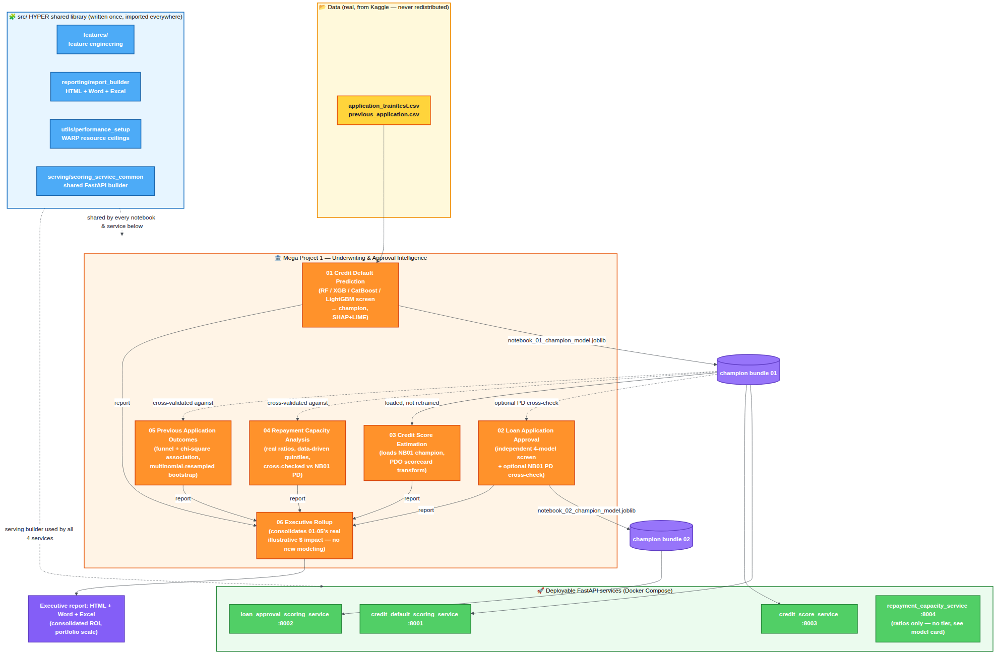

# Mega Project 1 — Underwriting & Approval Intelligence

Part of the **Home Credit RiskIQ Enterprise Suite**. See the [root
README](../README.md) for the full 5-Mega-Project roadmap and how this
folder fits in.

**History:** see this Mega Project's own [`CHANGELOG.md`](CHANGELOG.md)
for a curated version history, or the
[root `CHANGELOG.md`](../CHANGELOG.md) for the full suite-wide detail.

> **Folder name note (resolved in [1.0.3])**: this folder was previously
> checked out as `mega_project_3_underwriting_approval/` — a leftover from
> before the suite's final 1-5 Mega Project numbering was settled. It has
> since been renamed to `01_mega_project_1_underwriting_approval/`, matching
> its actual identity as the first Mega Project to reach enterprise-grade
> status, with every service, Docker, test, and CI path reference updated
> in the same change and all 6 notebooks re-verified end-to-end after the
> rename. See the root `CHANGELOG.md` [1.0.3] entry for the full disclosure.

## Problems in this Mega Project

| # | Problem | Notebook | Model card | Service |
|---|---|---|---|---|
| 1 | Credit Default Prediction | `notebooks/01_credit_default_prediction.ipynb` | [model card](model_cards/01_credit_default_prediction_MODEL_CARD.md) | `credit_default_scoring_service.py` :8001 |
| 2 | Loan Application Approval | `notebooks/02_loan_application_approval.ipynb` | [model card](model_cards/02_loan_application_approval_MODEL_CARD.md) | `loan_approval_scoring_service.py` :8002 |
| 3 | Credit Score Estimation (PDO scorecard) | `notebooks/03_credit_score_estimation.ipynb` | [model card](model_cards/03_credit_score_estimation_MODEL_CARD.md) | `credit_score_service.py` :8003 |
| 4 | Repayment Capacity Analysis | `notebooks/04_repayment_capacity_analysis.ipynb` | [model card](model_cards/04_repayment_capacity_analysis_MODEL_CARD.md) | `repayment_capacity_service.py` :8004 (ratios only — see model card) |
| 5 | Previous Application Outcomes | `notebooks/05_previous_application_outcomes.ipynb` | [model card](model_cards/05_previous_application_outcomes_MODEL_CARD.md) | none — portfolio-level analysis, see model card |
| 6 | Executive Rollup (all 5 above) | `notebooks/06_mp1_executive_report.ipynb` | n/a — not a model | none |

**Renumbered from this suite's original global 1/3/4/11/12 numbering to
local 1-5 (+ 6 for the rollup) — matching Mega Project 2 and Mega Project
3's convention.** See the root `CHANGELOG.md` for the full old→new mapping
and rationale.

## Architecture



Data → the HYPER shared library (`src/`) → the 6 notebooks → deployable
FastAPI services. Full-resolution image:
[`docs/mp1_architecture_flow.png`](../docs/mp1_architecture_flow.png)
([Mermaid source](../docs/mp1_architecture_flow.mmd)).

## Sample reports — every problem, all 3 formats

Generated by actually running each notebook against this suite's synthetic
verification fixture — never your real data (see
[`sample_reports/README.md`](sample_reports/README.md) for the full
fixture-vs-real disclosure). "Live dashboard" is the real, rendered
GitHub Pages page; "repo copy" is the same HTML file viewed as raw source
in GitHub's file browser (see [Live Dashboards](../README.md#live-dashboards)
in the root README for why those differ).

| # | Problem | Live dashboard | Dashboard (repo copy) | Report (Word) | Workbook (Excel) |
|---|---|---|---|---|---|
| 1 | Credit Default Prediction | [live](https://rnanda19.github.io/Home_Credit_RiskIQ_Enterprise_Suite/dashboards/notebook_01_dashboard.html) | [html](sample_reports/SAMPLE_notebook_01_dashboard.html) | [docx](sample_reports/SAMPLE_notebook_01_report.docx) | [xlsx](sample_reports/SAMPLE_notebook_01_workbook.xlsx) |
| 2 | Loan Application Approval | [live](https://rnanda19.github.io/Home_Credit_RiskIQ_Enterprise_Suite/dashboards/notebook_02_dashboard.html) | [html](sample_reports/SAMPLE_notebook_02_dashboard.html) | [docx](sample_reports/SAMPLE_notebook_02_report.docx) | [xlsx](sample_reports/SAMPLE_notebook_02_workbook.xlsx) |
| 3 | Credit Score Estimation | [live](https://rnanda19.github.io/Home_Credit_RiskIQ_Enterprise_Suite/dashboards/notebook_03_dashboard.html) | [html](sample_reports/SAMPLE_notebook_03_dashboard.html) | [docx](sample_reports/SAMPLE_notebook_03_report.docx) | [xlsx](sample_reports/SAMPLE_notebook_03_workbook.xlsx) |
| 4 | Repayment Capacity Analysis | [live](https://rnanda19.github.io/Home_Credit_RiskIQ_Enterprise_Suite/dashboards/notebook_04_dashboard.html) | [html](sample_reports/SAMPLE_notebook_04_dashboard.html) | [docx](sample_reports/SAMPLE_notebook_04_report.docx) | [xlsx](sample_reports/SAMPLE_notebook_04_workbook.xlsx) |
| 5 | Previous Application Outcomes | [live](https://rnanda19.github.io/Home_Credit_RiskIQ_Enterprise_Suite/dashboards/notebook_05_dashboard.html) | [html](sample_reports/SAMPLE_notebook_05_dashboard.html) | [docx](sample_reports/SAMPLE_notebook_05_report.docx) | [xlsx](sample_reports/SAMPLE_notebook_05_workbook.xlsx) |
| 6 | Executive Rollup | [live](https://rnanda19.github.io/Home_Credit_RiskIQ_Enterprise_Suite/dashboards/mp1_executive_dashboard.html) | [html](sample_reports/SAMPLE_mp1_executive_dashboard.html) | [docx](sample_reports/SAMPLE_mp1_executive_report.docx) | [xlsx](sample_reports/SAMPLE_mp1_executive_report.xlsx) |

**Remember: every number in these files comes from the synthetic fixture,
not your real Kaggle data** — download the dataset and run the notebooks
yourself (see [Running the notebooks](#running-the-notebooks) below) to
get the real versions.

All 5 problem notebooks are independently runnable; several also
cross-validate against Notebook 01's real champion model when its bundle
is present (see each model card's "Relationship to..." / "Cross-validated
against..." section). Notebook 06 must be run **last** — it consolidates
the real illustrative dollar-impact figures already written to each
notebook's own JSON artifact, and produces nothing new of its own.

## Standing rules (apply to every notebook here)

- **Zero-fabrication**: notebooks only ever run against real data you
  provide (the Kaggle dataset) or, for this repo's own verification, a
  synthetic fixture matching the real schema — never against a description
  of what the real output "should" look like.
- **WARP** resource governance: CPU/memory ceilings are configured before
  any heavy library import (`src/utils/performance_setup.py`), so a
  notebook never claims 100% of the host machine.
- **HYPER** shared library: feature engineering, reporting, and serving
  code live once in `src/` and are imported by every notebook/service here
  — not copy-pasted per problem.
- `RANDOM_SEED = 42` everywhere randomness is involved, for reproducibility.
- One markdown cell + one consolidated code cell per notebook (this suite's
  established notebook-authoring convention).
- No absolute local file paths are ever printed in notebook output.
- Every notebook was executed for real (`jupyter nbconvert --execute`)
  against a synthetic fixture during this build's verification, confirmed
  0 errors, then had its outputs cleared before delivery — see the root
  README's verification-protocol section for the full checklist this
  repo's contents were held to.

## Running the notebooks

1. Download the real **Home Credit Default Risk** dataset from Kaggle (not
   redistributed in this repo — see `data/raw/.gitkeep` at the suite root
   and the note in `LICENSE`).
2. Create `project_config.json` at the suite root — see any notebook's
   first markdown cell for the exact expected format/paths.
3. `pip install -e ".[dev,serving,explainability]"` from the suite root (or
   just `pip install -r requirements.txt` if you don't need the optional
   groups).
4. Run notebooks 01 → 02 → 03 → 04 → 05 → 06, in that order, so each
   notebook's optional cross-validation against upstream artifacts has
   something real to check against. (01, 02, 04, and 05 will each still
   run standalone if you skip ahead — only their optional cross-checks are
   affected.)
5. Outputs land in `decision_engine/artifacts/` (trained model bundles,
   `.png` charts) and `decision_engine/reports/` (per-notebook JSON/HTML/
   Word/Excel reports plus Notebook 06's consolidated executive report),
   overwritten in place on every run.

## Running the scoring services

```bash
# from the suite root, after running notebooks 01/02 so their .joblib bundles exist
pip install -r 01_mega_project_1_underwriting_approval/services/requirements-services.txt
export PYTHONPATH="$PWD/src:$PWD/01_mega_project_1_underwriting_approval/services"
uvicorn credit_default_scoring_service:app --port 8001   # Problem 1
uvicorn loan_approval_scoring_service:app --port 8002    # Problem 2
uvicorn credit_score_service:app --port 8003             # Problem 3
uvicorn repayment_capacity_service:app --port 8004        # Problem 4
```

Or via Docker Compose (build context is the **suite root**, not this
folder — see the comment at the top of `docker/docker-compose.yml`):

```bash
# from the suite root
docker compose -f 01_mega_project_1_underwriting_approval/docker/docker-compose.yml up --build
```

**Honesty note**: the Docker files were verified structurally in this
build's environment (`docker compose config`, plus a static COPY-path
resolution check) — there is no Docker daemon or registry access in the
build sandbox, so an actual `docker build`/`docker run` has **not** been
performed by this project. Treat it as untested until you build it
yourself; see `BENCHMARKS.md` at the suite root.

## Tests

```bash
cd 01_mega_project_1_underwriting_approval && python -m pytest tests/ -v
```

5 tests in `tests/test_scoring_services.py` check each service's output
against an independent reference computation. Tests for a given service
are skipped (not failed) when that service's upstream `.joblib` bundle
isn't present locally — this is expected until you've run the
corresponding notebook.

## Folder structure

```
01_mega_project_1_underwriting_approval/
├── notebooks/         # 01-05 problem notebooks + 06 executive rollup
├── model_cards/        # one MODEL_CARD.md per problem
├── services/           # FastAPI scoring services (thin wrappers over src/serving/)
├── docker/              # Dockerfile + docker-compose.yml (suite-root build context)
├── tests/                # pytest suite for the services
└── decision_engine/
    ├── artifacts/        # trained model bundles (.joblib) + chart .png files (gitignored)
    └── reports/           # per-notebook JSON/HTML/Word/Excel reports (gitignored)
```
