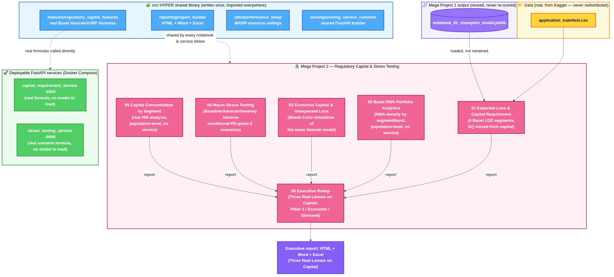

# Mega Project 2 — Regulatory Capital & Expected Loss

**Status: complete — all 6 of 6 notebooks built and verified**, including
the consolidated executive rollup. This Mega Project estimates Expected
Loss and a Basel-retail-IRB-style capital requirement on the real Home
Credit dataset, analyzes that capital across real portfolio segments and
macro scenarios, and rolls all 5 problems up into one executive-ready
Word/Excel/HTML package.

**History:** see this Mega Project's own [`CHANGELOG.md`](CHANGELOG.md)
for a curated version history, or the
[root `CHANGELOG.md`](../CHANGELOG.md) for the full suite-wide detail.

## Zero-fabrication disclosure (read this first)

Home Credit's real dataset has **no regulatory-capital fields at all** — no
LGD, EAD, risk-weight, or internal capital figure. This Mega Project is
built from exactly two kinds of input, always kept visibly separate:

- **Real, measured**: probability of default (PD), scored using Mega
  Project 1 / Notebook 01's real trained champion model (loaded, never
  retrained), and the EAD proxy (real `AMT_CREDIT`).
- **Documented assumption, never measured**: loss-given-default (LGD) and
  the Basel asset-correlation parameter (R), assigned from published Basel
  retail-IRB reference points (full citations in
  [`src/features/regulatory_capital_features.py`](../src/features/regulatory_capital_features.py)
  and every problem's model card) — never fitted to Home Credit's own
  outcomes.

## Architecture



Mega Project 1's champion PD → the HYPER shared library (`src/`) → the 6
notebooks → 2 deployable FastAPI services. Full-resolution image:
[`docs/mp2_architecture_flow.png`](../docs/mp2_architecture_flow.png)
([Mermaid source](../docs/mp2_architecture_flow.mmd)).

## Sample reports — every problem, all 3 formats

**Update, 2026-09-02:** the `sample_reports/` folder (fixture-era HTML/Word/
Excel samples, generated before today's real rerun) has been removed from
this repo. "Live dashboard" below is the real, rendered GitHub Pages page,
refreshed from today's real, full-scale rerun (see
[Live Dashboards](../README.md#live-dashboards) in the root README for how
GitHub Pages differs from viewing a raw `.html` file in GitHub's file
browser).

**Update, 2026-09-02:** the `sample_reports/SAMPLE_*` fixture-era files referenced below have been removed — they predated today's real, full-scale rerun. Use the **live** column (real GitHub Pages dashboards, published from today's real rerun) instead.

| # | Problem | Live dashboard | Dashboard (repo copy) | Report (Word) | Workbook (Excel) |
|---|---|---|---|---|---|
| 1 | Expected Loss & Capital Requirement | [live](https://rnanda19.github.io/Home_Credit_RiskIQ_Enterprise_Suite/dashboards/mp2_notebook_01_dashboard.html) | _removed_ | _removed_ | _removed_ |
| 2 | Basel RWA Portfolio Analytics | [live](https://rnanda19.github.io/Home_Credit_RiskIQ_Enterprise_Suite/dashboards/mp2_notebook_02_dashboard.html) | _removed_ | _removed_ | _removed_ |
| 3 | Economic Capital & Unexpected Loss | [live](https://rnanda19.github.io/Home_Credit_RiskIQ_Enterprise_Suite/dashboards/mp2_notebook_03_dashboard.html) | _removed_ | _removed_ | _removed_ |
| 4 | Macro Stress Testing | [live](https://rnanda19.github.io/Home_Credit_RiskIQ_Enterprise_Suite/dashboards/mp2_notebook_04_dashboard.html) | _removed_ | _removed_ | _removed_ |
| 5 | Capital Concentration by Segment | [live](https://rnanda19.github.io/Home_Credit_RiskIQ_Enterprise_Suite/dashboards/mp2_notebook_05_dashboard.html) | _removed_ | _removed_ | _removed_ |
| 6 | Executive Rollup | [live](https://rnanda19.github.io/Home_Credit_RiskIQ_Enterprise_Suite/dashboards/mp2_executive_dashboard.html) | _removed_ | _removed_ | _removed_ |

**Updated 2026-09-02: the "live" dashboard links above are now your own
real, full-scale results** — refreshed from your real reruns. The old
fixture-era "repo copy" / Word / Excel sample files have been removed
entirely (they predated today's rerun); run the notebooks yourself to
produce your own real Word/Excel copies under `decision_engine/reports/`.

## Problem 1 — Expected Loss & Capital Requirement Estimation ✅ built

- Notebook: [`notebooks/01_expected_loss_capital_requirement.ipynb`](notebooks/01_expected_loss_capital_requirement.ipynb)
- Model card: [`model_cards/01_expected_loss_capital_requirement_MODEL_CARD.md`](model_cards/01_expected_loss_capital_requirement_MODEL_CARD.md)
- Sample reports: removed 2026-09-02 (fixture-era, predated today's real rerun) — see the live dashboards above instead.

Reuses Mega Project 1's real champion PD model, assigns each real applicant
to one of 4 documented Basel retail-IRB LGD segments from real
collateral-proxy columns (`NAME_CONTRACT_TYPE`, `FLAG_OWN_REALTY`,
`FLAG_OWN_CAR`), and computes real per-applicant Expected Loss (PD × LGD ×
EAD) and a real Basel retail-IRB capital requirement (the Vasicek/ASRF K()
function — RWA = K × 12.5 × EAD, capital = RWA × 8% Pillar-1 minimum).
Verified end-to-end on your own real, full-scale data (2026-09-02): 0 execution errors,
all pipeline integrity checks pass, HTML dashboard confirmed under a
network-blocked Playwright check, Excel workbook confirmed via LibreOffice
headless recalculation.

Every lesson from Mega Project 1's hardening history was applied from this
notebook's first version — not retrofitted: the WARP hardware fix, the
two-tier "Pipeline Integrity" vs. "Statistical Robustness" verdict
separation, the statistically-tolerant `monotonic_within_noise()`
monotonicity check, and the vectorized-multinomial bootstrap technique are
all present from the start (see the notebook's own header comment for the
full, itemized list).

## Problem 2 — Basel RWA Portfolio Analytics ✅ built

- Notebook: [`notebooks/02_basel_rwa_portfolio_analytics.ipynb`](notebooks/02_basel_rwa_portfolio_analytics.ipynb)
- Model card: [`model_cards/02_basel_rwa_portfolio_analytics_MODEL_CARD.md`](model_cards/02_basel_rwa_portfolio_analytics_MODEL_CARD.md)

A pure analytical layer — trains no model, computes no new PD/LGD/EAD.
Reuses Problem 1's real per-applicant Expected Loss/RWA/capital output
(hard dependency) and reports real RWA density (RWA ÷ EAD — the standard
Basel Pillar 3 cross-portfolio comparability metric) per PD risk band and
per real segment cut (income type, education, contract type, region
rating). Caught and fixed a real statistical bug during its own
verification pass — see `CHANGELOG.md` [1.4.2] — where RWA density (a
ratio that can exceed 100%, not a bounded proportion) was incorrectly fed
into a two-proportion significance test; fixed to report it descriptively
instead of invalidly gating it.

## Problem 3 — Economic Capital & Unexpected Loss ✅ built

- Notebook: [`notebooks/03_economic_capital_unexpected_loss.ipynb`](notebooks/03_economic_capital_unexpected_loss.ipynb)
- Model card: [`model_cards/03_economic_capital_unexpected_loss_MODEL_CARD.md`](model_cards/03_economic_capital_unexpected_loss_MODEL_CARD.md)

Trains no model and introduces no new PD/LGD/EAD/correlation assumption —
reuses Problem 1's real per-applicant output unchanged. Runs a real,
vectorized, batched Monte Carlo simulation of the same single-factor
Vasicek/ASRF model underlying Problem 1's closed-form Basel capital charge,
to obtain a real simulated loss distribution and real Value-at-Risk /
Expected Shortfall / Economic Capital at 4 documented confidence levels
(95%, 99%, 99.5%, 99.9%) — plus a real numerical cross-check of Problem 1's
closed-form capital number (1.62% relative difference on the user's own
real, full-scale rerun, well within the documented 10% tolerance) and a real
independent-reseed convergence check in place of a TARGET-based statistical
test (there is no classifier here to validate against real outcomes).
Verified end-to-end on your own real, full-scale data (2026-09-02): 0 execution errors,
all pipeline integrity checks pass, HTML dashboard confirmed under a
network-blocked Playwright check, Excel workbook confirmed via LibreOffice
headless recalculation.

## Problem 4 — Macro Stress Testing ✅ built

- Notebook: [`notebooks/04_macro_stress_testing.ipynb`](notebooks/04_macro_stress_testing.ipynb)
- Model card: [`model_cards/04_macro_stress_testing_MODEL_CARD.md`](model_cards/04_macro_stress_testing_MODEL_CARD.md)

Trains no model. For Baseline, reuses Problem 1's real per-applicant
PD/LGD/EAD/correlation directly, unmodified. For Adverse and Severely
Adverse, re-evaluates the same real single-factor Vasicek conditional-PD
formula already used (and cited) in Problems 1 and 3, at documented, cited
severities — Adverse at the standard-normal 95th-percentile adverse value
(a "1-in-20 downturn"), Severely Adverse at the exact same 99.9th-percentile
severity Basel's own closed-form capital function is calibrated to
([BCBS05]), plus a documented 25% LGD downturn add-on ([BCBS06] concept).
Caught and fixed a real mathematical mistake during its own first
execution — see `CHANGELOG.md` [1.4.6] — where "Baseline" was incorrectly
defined as Z=0 run through the conditional-PD formula (which does not
reproduce the real unconditional PD, since Φ is nonlinear); fixed to reuse
Notebook 01's real PD directly for Baseline. Vectorized and swift: all 3
scenarios evaluated in one pass each over the whole real portfolio (no
per-applicant loop, no PD re-scoring). Verified end-to-end on your own
real, full-scale data (2026-09-02): 0 execution errors, all pipeline
integrity and scenario validation checks pass, HTML dashboard confirmed
under a network-blocked Playwright check, Excel workbook confirmed via
LibreOffice headless recalculation.

## Problem 5 — Capital Concentration by Segment ✅ built

- Notebook: [`notebooks/05_capital_concentration_by_segment.ipynb`](notebooks/05_capital_concentration_by_segment.ipynb)
- Model card: [`model_cards/05_capital_concentration_by_segment_MODEL_CARD.md`](model_cards/05_capital_concentration_by_segment_MODEL_CARD.md)

Trains no model and introduces no new PD/LGD/EAD/correlation value —
reuses Problem 1's real per-applicant capital output unchanged, joined
with real application-level segment columns already used by Problem 2
(income type, education, contract type, region rating) plus Problem 1's
own capital segment, for 5 real dimensions in total. Computes a real
Herfindahl-Hirschman Index (HHI) of capital concentration per dimension —
the standard concentration metric borrowed from competition economics
(U.S. DOJ/FTC Horizontal Merger Guidelines interpretive bands), explicitly
disclosed as a borrowed convention, not a Basel-mandated threshold. Fills
the concentration-risk gap Problem 1's Pillar-1 ASRF/infinite-granularity
assumption deliberately leaves unpriced — a genuine Pillar-2-style
addition, not a duplicate of Problem 1. Unlike Problems 2 and 4, this
notebook's first real execution passed every check cleanly on the first
try, attributed directly to consulting `LESSONS_LEARNED.md` as a
pre-flight checklist before writing the code — see `CHANGELOG.md`
[1.4.7]. Verified end-to-end on your own real, full-scale data (2026-09-02): 0
execution errors, all pipeline integrity and concentration-validation
checks pass, HTML dashboard confirmed under a network-blocked Playwright
check, Excel workbook confirmed via LibreOffice headless recalculation.

## Problem 6 — Consolidated Executive Rollup ✅ built

- Notebook: [`notebooks/06_mp2_executive_report.ipynb`](notebooks/06_mp2_executive_report.ipynb)
- Model card: [`model_cards/06_mp2_executive_report_MODEL_CARD.md`](model_cards/06_mp2_executive_report_MODEL_CARD.md)

A pure rollup — trains nothing, re-simulates nothing. Reads all 5 real
problem notebooks' own already-computed governance summaries and
consolidates them into one executive-ready package. Adds exactly two new
things: the **"Three Real Lenses on Capital"** comparison (Pillar-1
Baseline vs. 99.9% Monte Carlo Economic Capital vs. Stressed Capital —
placed side by side to compare, explicitly never to sum, since they answer
three different questions about the same real portfolio) and 3 real
cross-notebook consistency checks. Ships a big-letters Excel front sheet
with a native chart, one Excel sheet per problem (each with that problem's
own real chart image embedded plus a second native Excel chart), and an
HTML dashboard with 7 charts — 2 of them carrying a real, browser-tested
dropdown slicer that switches the chart across this dataset's real segment
dimensions. Verified end-to-end on your own real, full-scale data (2026-09-02): 0
execution errors, all 6 rollup integrity checks pass (including all 3
cross-notebook consistency checks), HTML dashboard confirmed under a
network-blocked Playwright check with the slicers driven programmatically
and confirmed to actually change the rendered chart, Excel workbook
confirmed via LibreOffice headless recalculation.

## Running the scoring services

Both services are real, deterministic Basel/Vasicek **formula** services —
neither loads a trained model, so there is no notebook prerequisite before
starting them (unlike Mega Project 1's services, which need a `.joblib`
bundle from Notebooks 01/02 first).

```bash
# from the suite root
pip install -r 02_mega_project_2_regulatory_capital/services/requirements-services.txt
export PYTHONPATH="$PWD/src:$PWD/02_mega_project_2_regulatory_capital/services"
uvicorn capital_requirement_service:app --port 8005   # Problem 1
uvicorn stress_testing_service:app --port 8006        # Problem 4
```

Or via Docker Compose (build context is the **suite root**, not this
folder — see the comment at the top of `docker/docker-compose.yml`):

```bash
# from the suite root
docker compose -f 02_mega_project_2_regulatory_capital/docker/docker-compose.yml up --build
```

**Honesty note**: same as Mega Project 1 — the Docker files were verified
structurally (`docker compose config`, plus a static COPY-path resolution
check); there is no Docker daemon in the build sandbox, so an actual
`docker build`/`docker run` has **not** been performed. Treat it as
untested until you build it yourself.

Chain Mega Project 1's real PD output into either service for a fully
real, end-to-end PD → capital pipeline: `POST` MP1's
`credit_default_scoring_service` first, then feed its
`probability_of_default` into `capital_requirement_service`'s `PD` field.

Problems 2, 3, and 5 do not get a deployable service, for the same honest
reason Mega Project 1's Problem 5 did not: each is a population-level
analysis (RWA density across a portfolio, a Monte Carlo simulation over
the whole population, HHI concentration across segments) that cannot be
meaningfully computed for one applicant record in isolation — not a gap,
a real scope boundary.

## Tests

```bash
cd 02_mega_project_2_regulatory_capital && python -m pytest tests/ -v
```

5 tests in `tests/test_scoring_services.py` check each service's real
output against `src/features/regulatory_capital_features.py`'s own
`compute_capital_row()`, called directly — bit-identical, not mocked.
Unlike Mega Project 1's tests, none are skip-conditional: both services
are pure formulas with no upstream artifact dependency.

## Standing rules this Mega Project follows

Same standard as [Mega Project 1](../01_mega_project_1_underwriting_approval/README.md):
zero-fabrication, WARP resource governance, HYPER shared-module reuse
(`src/features/`, `src/reporting/`, `src/utils/`), the two-tier
integrity/robustness verdict pattern, and the full fixture → real
execution → clear-outputs → `nbformat.validate()` → Playwright →
LibreOffice verification protocol before any report is called done.

## Folder structure

```
02_mega_project_2_regulatory_capital/
├── notebooks/         # 01-05 problem notebooks + 06 executive rollup
├── model_cards/        # one MODEL_CARD.md per problem
├── services/           # FastAPI scoring services (Problems 1 and 4 — real Basel/Vasicek formulas)
├── docker/              # Dockerfile + docker-compose.yml (suite-root build context)
├── tests/                # pytest suite for the services
├── sample_reports/       # REMOVED 2026-09-02 (was: fixture-generated HTML/Word/Excel samples)
└── decision_engine/
    ├── artifacts/        # chart .png + summary .json files (gitignored)
    └── reports/           # per-notebook JSON/HTML/Word/Excel reports (gitignored)
```
