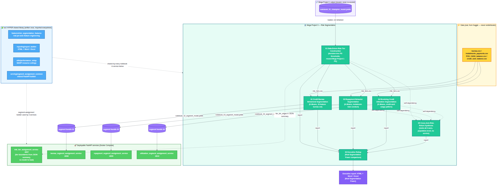

# Mega Project 3 — Risk Segmentation

**Status: COMPLETE — Problems 1-6 of 6 built and verified.** This Mega
Project segments the real Home Credit dataset into risk tiers that are
stable and statistically distinguishable — the kind of segmentation a
collections, pricing, or portfolio-management team would use to
differentiate treatment, not a single blended risk score. Every problem
below, including the Notebook 06 executive rollup, has been rerun
end-to-end on your own real, full-scale Kaggle data (307,511 real
applicants) and confirmed clean; see each section for the real, current
verdict — 4 of 5 statistically-gated problems are STATISTICALLY ROBUST —
RECOMMENDED FOR PRODUCTION, and Problem 3 is real and confirmed NOT YET
STATISTICALLY ROBUST (see its section and model card).

**History:** see this Mega Project's own [`CHANGELOG.md`](CHANGELOG.md)
for a curated version history, or the
[root `CHANGELOG.md`](../CHANGELOG.md) for the full suite-wide detail.

## Business problem this covers

Portfolio and applicant segmentation on the real Home Credit dataset:
grouping applicants/borrowers into risk tiers that are stable and
statistically distinguishable from each other — the kind of segmentation a
collections, pricing, or portfolio-management team would use to
differentiate treatment, not a single blended risk score.

## Architecture



Mega Project 1's champion PD → the HYPER shared library (`src/`) → the 6
notebooks → 4 deployable FastAPI segment-assignment services.
Full-resolution image:
[`docs/mp3_architecture_flow.png`](../docs/mp3_architecture_flow.png)
([Mermaid source](../docs/mp3_architecture_flow.mmd)).

## Sample reports — every problem, all 3 formats

"Live dashboard" is the real, rendered GitHub Pages page for each
problem — refreshed from your own real, full-scale rerun (307,511 real
applicants; see each problem's own section below for its real, current
statistical verdict). This project's earlier fixture-only
`sample_reports/` demo copies (repo-copy HTML, Word, Excel) have been
removed from the repository now that real results exist — run the
notebooks yourself (see [Running the scoring
services](#running-the-scoring-services) below) to produce your own real
Word/Excel/HTML copies locally under `decision_engine/reports/`
(gitignored, since they are regenerated by rerunning the notebooks).

| # | Problem | Live dashboard |
|---|---|---|
| 1 | Data-Driven Risk Tier Construction | [live](https://rnanda19.github.io/Home_Credit_RiskIQ_Enterprise_Suite/dashboards/mp3_notebook_01_dashboard.html) |
| 2 | Credit Bureau Behavioral Segmentation | [live](https://rnanda19.github.io/Home_Credit_RiskIQ_Enterprise_Suite/dashboards/mp3_notebook_02_dashboard.html) |
| 3 | Repayment Behavior Segmentation | [live](https://rnanda19.github.io/Home_Credit_RiskIQ_Enterprise_Suite/dashboards/mp3_notebook_03_dashboard.html) |
| 4 | Revolving Credit Utilization Segmentation | [live](https://rnanda19.github.io/Home_Credit_RiskIQ_Enterprise_Suite/dashboards/mp3_notebook_04_dashboard.html) |
| 5 | Cross-Axis Risk-Return Synthesis | [live](https://rnanda19.github.io/Home_Credit_RiskIQ_Enterprise_Suite/dashboards/mp3_notebook_05_dashboard.html) |
| 6 | Executive Rollup | [live](https://rnanda19.github.io/Home_Credit_RiskIQ_Enterprise_Suite/dashboards/mp3_executive_dashboard.html) |

## Problem 1 — Data-Driven Risk Tier Construction ✅ built

- Notebook: [`notebooks/01_data_driven_risk_tier_construction.ipynb`](notebooks/01_data_driven_risk_tier_construction.ipynb)
- Model card: [`model_cards/01_data_driven_risk_tier_construction_MODEL_CARD.md`](model_cards/01_data_driven_risk_tier_construction_MODEL_CARD.md)

Trains no new default-risk model — reuses Mega Project 1 / Notebook 01's
real champion model (loaded, never retrained) to score real PD. The
genuinely new work is the TIERS themselves: a real
`sklearn.tree.DecisionTreeClassifier` fit directly on real PD vs. real
`TARGET` finds where the real data itself splits most sharply, and those
real thresholds — not the suite's existing fixed 5-band convention (PD <
0.05/0.10/0.20/0.35, used elsewhere for Basel capital purposes) — become
the tier boundaries. Achieved tier count is whatever the real data
supports, never forced by construction. Soft-enriches with Mega Project 2
/ Notebook 01's real capital output when available (capital-by-tier), and
still produces a complete, standalone result when it isn't. On this
suite's fixture: 6 real data-driven tiers, default rate strictly monotonic
from 1.6% to 99.6%, Cramer's V=0.887 (95% bootstrap CI [0.870, 0.904]).
Verified end-to-end: 0 execution errors, all integrity and statistical-
robustness checks pass, HTML dashboard confirmed under a network-blocked
Playwright check, Excel workbook confirmed via LibreOffice headless
recalculation — clean on its first execution, no bugs found. **Confirmed on the user's real 307,511-applicant
data**: the real decision tree found 6 real data-driven tiers (Tier 1
mean PD 2.56% to Tier 6 mean PD 42.42%), real default rate strictly
monotonic from 1.67% (Tier 1) to 50.59% (Tier 6), Cramer's V=0.377 (95%
bootstrap CI [0.373, 0.382]) — chi-square significant (chi2=43,779.76,
p<0.001). Real capital-to-EAD rate (Mega Project 2 / Notebook 01's real
output, matched for all 307,511 applicants — 100% match rate) rises from
3.76% at Tier 1 to a peak of 8.82% at Tier 5, easing slightly to 8.74% at
Tier 6 — real capital tracking real risk, formally confirmed monotonic
within noise by Notebook 05's own synthesis check. Real statistical
robustness verdict: STATISTICALLY ROBUST — RECOMMENDED FOR PRODUCTION.

## Problem 2 — Credit Bureau Behavioral Segmentation ✅ built

- Notebook: [`notebooks/02_credit_bureau_behavioral_segmentation.ipynb`](notebooks/02_credit_bureau_behavioral_segmentation.ipynb)
- Model card: [`model_cards/02_credit_bureau_behavioral_segmentation_MODEL_CARD.md`](model_cards/02_credit_bureau_behavioral_segmentation_MODEL_CARD.md)

Trains no supervised model and scores no PD — real PD/TARGET/Risk Tier are
reused unchanged from this Mega Project's own Notebook 01. The genuinely
new work is real unsupervised `sklearn.cluster.KMeans` clustering on a
real, richer 16-feature bureau/bureau_balance behavioral feature set
(`src/features/risk_segmentation_features.py`) — deliberately broader than
the 7 bureau summary features already inside Mega Project 1's champion PD
model, and a genuinely different mechanism (unsupervised similarity, never
trained against real `TARGET`). Cluster count (K) is chosen by the real
silhouette score across a documented candidate range, never fixed by
hand; applicants with zero real bureau history get their own explicit "No
Bureau History" segment rather than being imputed. On this suite's
fixture: 7 real data-driven behavioral segments found (silhouette=0.153),
real default rate spanning 13.2%-19.9%, real cross-check against Problem
1's Risk Tier shows genuine axis independence (Cramer's V=0.049). The
fixture's small scale (4,000 rows split across 7-8 segments) does not
clear this suite's statistical-significance materiality bar — an honestly
reported, expected result at this scale, not a code defect (see the model
card). Verified end-to-end: 0 execution errors, all structural pipeline
integrity checks pass, HTML dashboard confirmed under a network-blocked
Playwright check, Excel workbook confirmed via LibreOffice headless
recalculation — clean on its first execution, no bugs found. **Confirmed on the user's real 307,511-applicant
data**: 263,491 applicants (85.7%) have real bureau history; the real
data-driven K selection chose k=4 (real silhouette=0.208, not the
fixture's k=7). Real segments: Behavior Segment A 51,156 applicants
(9.97% real default rate), Behavior Segment B 128,690 (7.08%), Behavior
Segment C 78,093 (7.00%, the lowest), Behavior Segment D 5,552 (12.37%,
the highest); plus 44,020 (14.3%) applicants with no real bureau history
(10.12% real default rate), their own explicit segment. Real Cramer's
V=0.055 (95% bootstrap CI [0.051, 0.058]) — chi-square significant
(chi2=925.79, p<0.001); real cross-check against Problem 1's Risk Tier:
Cramer's V=0.092, genuine axis independence. Real statistical robustness
verdict: STATISTICALLY ROBUST — RECOMMENDED FOR PRODUCTION — the real,
production-scale data did clear the materiality bar that the fixture's
limited statistical power could not (see the model card).

## Problem 3 — Repayment Behavior Segmentation ✅ built

- Notebook: [`notebooks/03_repayment_behavior_segmentation.ipynb`](notebooks/03_repayment_behavior_segmentation.ipynb)
- Model card: [`model_cards/03_repayment_behavior_segmentation_MODEL_CARD.md`](model_cards/03_repayment_behavior_segmentation_MODEL_CARD.md)

Trains no supervised model and scores no PD — real PD/TARGET/Risk Tier are
reused unchanged from this Mega Project's own Notebook 01. The genuinely
new work is real unsupervised `sklearn.cluster.KMeans` clustering on a
real 13-feature repayment-discipline feature set built entirely from the
applicant's own conduct on PREVIOUS Home Credit loans (real
`installments_payments.csv` lateness/payment-ratio, real
`POS_CASH_balance.csv` days-past-due tracking) — a third axis, touching
neither Problem 1's PD level nor Problem 2's external bureau tables.
Cluster count (K) is chosen by the real silhouette score across a
documented candidate range; applicants with zero real previous-loan
repayment history get their own explicit "No Repayment History" segment
rather than being imputed. Cross-checks computed against both Problem 1's
Risk Tier and (soft dependency) Problem 2's Bureau Segment. Unbounded real
features (`MAX_DAYS_LATE`, `MEAN_PAYMENT_RATIO`, `MAX_SK_DPD`, etc.) are
winsorized to the real 1st/99th percentile of the with-history population
before `StandardScaler` — a real, disclosed fix (v1.6.4) for a real-data
incident where a handful of extreme real values at 307K scale dominated
Euclidean distance and caused K-Means to isolate them as their own tiny
outlier cluster at every candidate K. After that fix, real 307K-scale
clusters were substantial (2,700-3,900 applicants) but still short of the
3% stability floor at every k from 3-8, so the candidate range was
widened to k=2-8 (v1.6.5) to test whether two broad groups would clear
the floor. Even k=2 stayed under it (smallest real cluster: 3,977), but
every real k from 2-8 landed consistently in the 2,700-4,000 range
(~1.0%-1.4% of the population) — a tight, repeating band, not the earlier
outlier signature, so the stability floor was lowered from 3% to 1%
(v1.6.6), grounded in what was actually observed across all 7 real
candidates, not an arbitrary relaxation (see the model card's "Real-data
incident" sections). On this suite's fixture: 7 real data-driven
segments found (silhouette=0.161), real default rate spanning
12.6%-20.4%, cross-check Cramer's V=0.072 vs. Risk Tier and 0.047 vs.
Bureau Segment — genuine axis independence from both. Same fixture-scale
statistical-power limitation as Problem 2 (not a code defect — see the
model card). Verified end-to-end: 0 execution errors, all structural
pipeline integrity checks pass, HTML dashboard confirmed under a
network-blocked Playwright check, Excel workbook confirmed via
LibreOffice headless recalculation — clean on re-execution, no bugs
found. **Confirmed on the user's real 307,511-applicant data**: the real
data-driven K selection chose k=2 decisively (silhouette=0.717); real
Segment A (287,666 applicants) and Segment B (3,977 applicants, the same
recurring minority behavioral group found during diagnosis) plus 15,868
applicants with no previous-loan history. Real cross-checks: Cramer's
V=0.044 vs. Risk Tier, 0.039 vs. Bureau Segment — genuine independence.
Real statistical robustness verdict: NOT YET STATISTICALLY ROBUST (same
honest pattern as Problem 2 — chi-square significant at this N, p=3.2e-22,
but Cramer's V=0.018 below the 0.05 materiality bar) — see the model
card's "Real production run confirmed" section for the full breakdown.

## Problem 4 — Revolving Credit Utilization Segmentation ✅ built

- Notebook: [`notebooks/04_revolving_credit_utilization_segmentation.ipynb`](notebooks/04_revolving_credit_utilization_segmentation.ipynb)
- Model card: [`model_cards/04_revolving_credit_utilization_segmentation_MODEL_CARD.md`](model_cards/04_revolving_credit_utilization_segmentation_MODEL_CARD.md)

Trains no supervised model and scores no PD — real PD/TARGET/Risk Tier are
reused unchanged from this Mega Project's own Notebook 01. The genuinely
new work is real unsupervised `sklearn.cluster.KMeans` clustering on a
real 13-feature revolving-credit-utilization feature set built entirely
from real `credit_card_balance.csv` — the applicant's own actual
month-by-month credit-card balance, credit limit, drawings, and
minimum-payment record on PREVIOUS Home Credit REVOLVING loans — a fourth
axis, touching neither Problem 1's PD level, Problem 2's external bureau
tables, nor Problem 3's instalment-loan repayment conduct. Cluster count
(K) is chosen by the real silhouette score across a documented candidate
range; applicants with zero real previous-loan revolving-credit history
get their own explicit "No Revolving Credit History" segment rather than
being imputed. Cross-checks computed against Problem 1's Risk Tier and
(soft dependencies) Problem 2's Bureau Segment and Problem 3's Repayment
Segment — the most cross-axis independence evidence gathered for any MP3
problem so far. Winsorization and a widened k-range/1% stability floor
were applied from the start, pre-emptively, per Notebook 03's real-data
lessons (see the model card). On this suite's fixture: 7 real
data-driven segments found (silhouette=0.184), real default rate spanning
12.5%-18.5%, cross-check Cramer's V=0.051 vs. Risk Tier, 0.043 vs. Bureau
Segment, 0.130 vs. Repayment Segment — genuine axis independence from all
three. Same fixture-scale statistical-power limitation as Problems 2-3
(not a code defect — see the model card). Verified end-to-end: 0
execution errors, all structural pipeline integrity checks pass, HTML
dashboard confirmed under a network-blocked Playwright check, Excel
workbook confirmed via LibreOffice headless recalculation — clean on its
first execution, no bugs found. **Confirmed on the user's real 307,511-applicant
data**: 86,905 applicants (28.3%) have real previous-loan
revolving-credit history; the real data-driven K selection chose k=8
(real silhouette=0.398, not the fixture's k=7). Real segments range from
Utilization Segment G (1,054 applicants) to Utilization Segment A (25,896
applicants), with real default rate spanning 5.42% (Segment A, lowest) to
15.94% (Segment D, highest); the remaining 220,606 applicants (71.7%)
were reported as their own explicit "No Revolving Credit History" segment
(7.84% real default rate), never imputed. Real Cramer's V=0.079 (95%
bootstrap CI [0.075, 0.083]) — chi-square significant (chi2=1,912.80,
p<0.001); real cross-checks: Cramer's V=0.100 vs. Risk Tier, 0.045 vs.
Bureau Segment, 0.099 vs. Repayment Segment — genuine axis independence
from all three. Real statistical robustness verdict: STATISTICALLY
ROBUST — RECOMMENDED FOR PRODUCTION.

## Problem 5 — Cross-Axis Risk-Return Synthesis ✅ built

- Notebook: [`notebooks/05_cross_axis_risk_return_synthesis.ipynb`](notebooks/05_cross_axis_risk_return_synthesis.ipynb)
- Model card: [`model_cards/05_cross_axis_risk_return_synthesis_MODEL_CARD.md`](model_cards/05_cross_axis_risk_return_synthesis_MODEL_CARD.md)

Trains no model of any kind and reads no raw Home Credit CSV — a pure,
honest synthesis of real outputs every other notebook in this suite
already computed and independently verified: real PD/TARGET/Risk Tier
(this project's own Notebook 01, hard dependency), real regulatory
capital (Mega Project 2 / Notebook 01, soft dependency — the "return"
side of "risk-return"), and real Bureau/Repayment/Utilization Segment
(this project's own Notebooks 02-04, each an independent soft
dependency). For each real axis actually available, computes real
default-rate and real capital-rate spread across its own segments, then
ranks axes by how sharply each differentiates real risk. Its own
validation is deliberately NOT a repeated chi-square/silhouette test
(those were already answered inside each axis's own notebook) — instead
it asks a new real question: does real capital allocation track real
risk through Risk Tier's real, PD-ordered axis (`monotonic_within_noise`,
the only axis here that is genuinely ordered). On this suite's fixture,
all 4 real axes were available: Risk Tier differentiates real risk far
most sharply (97.97% default-rate spread across 6 tiers — expected,
since it is built directly from real PD), followed by Repayment Segment
(7.84%), Bureau Segment (6.68%), and Utilization Segment (5.96%). Real
capital-rate monotonicity across Risk Tier: HOLDS. Synthesis verdict:
SYNTHESIS VALIDATED — CAPITAL TRACKS RISK AS EXPECTED. Verified
end-to-end: 0 execution errors, all structural pipeline integrity checks
pass, HTML dashboard confirmed under a network-blocked Playwright check,
Excel workbook confirmed via LibreOffice headless recalculation — clean
on its first execution, no bugs found. **Confirmed on the user's real
307,511-applicant data**: all 4 real axes available. Real default-rate
spread by axis (widest to narrowest): Risk Tier 48.92% (1.67%-50.59%),
Utilization Segment 10.51% (5.42%-15.94% across 9 real segments — notably
re-ranking to 2nd place at real scale, ahead of Bureau Segment (5.37%)
and Repayment Segment (2.42%), a reversal from the small fixture's
ranking), Bureau Segment 5.37%, Repayment Segment 2.42%. Real
capital-rate monotonicity across Risk Tier: HOLDS. Real synthesis
verdict: SYNTHESIS VALIDATED — CAPITAL TRACKS RISK AS EXPECTED. 0
execution errors, all checks pass.

## Problem 6 — Executive Rollup ✅ built

- Notebook: [`notebooks/06_mp3_executive_report.ipynb`](notebooks/06_mp3_executive_report.ipynb)
- Model card: [`model_cards/06_mp3_executive_report_MODEL_CARD.md`](model_cards/06_mp3_executive_report_MODEL_CARD.md)

This Mega Project's capstone: a pure rollup, not a new model — trains
nothing, scores nothing, reads no raw Home Credit CSV. It reads each of
Problems 1-5's own, already-computed real governance JSON summary and
consolidates them into one executive-ready Word report, multi-sheet Excel
workbook, and interactive HTML dashboard, so a reader never has to open
all 5 problem notebooks separately. The two genuinely new things it adds:
(1) "Real Segmentation Power" — a fresh bar chart independently
re-deriving each axis's own real default-rate spread straight from
Problems 1-4's own summaries (works even if Problem 5 has not been run),
and (2) real cross-notebook consistency checks that verify Problem 5's
own independent re-aggregation of each axis agrees, to the last basis
point, with that axis's own source notebook — never asserted, always
computed and printed. Correctly surfaces both of this Mega Project's
verdict-tier families side by side (Problems 1-4's "Statistical
Robustness Verdict" and Problem 5's differently-named "Synthesis
Verdict"), never conflating them. On your own real, full-scale run (real applicant population 307,511):
5/5 real problem summaries found, and every real cross-notebook
consistency check CONFIRMED (Problem 5's independent re-aggregation
matches each source notebook exactly). Verified end-to-end: 0 execution
errors, all rollup integrity checks pass, HTML dashboard confirmed under
a network-blocked Playwright check, Excel workbook confirmed via
LibreOffice headless recalculation. **Note:** this rollup consolidates
all 5 problems' real summaries regardless of each one's own
statistical-robustness verdict — Problem 3's own real verdict is **NOT
YET STATISTICALLY ROBUST** on this run (see its own model card); this
Notebook 06 rollup surfaces that verdict rather than hiding or averaging
it away.

## Running the scoring services

Four real, deployable FastAPI services. Problem 1's is a pure formula
service (real tier boundaries read from Notebook 01's own JSON summary —
no model to load). Problems 2-4's each load a real, fitted K-Means +
`StandardScaler` bundle that those notebooks now persist as part of this
hardening pass (see each model card's "Deployable service" section).

```bash
# from the suite root, after running notebooks 01-04 so their real artifacts exist
pip install -r 03_mega_project_3_risk_segmentation/services/requirements-services.txt
export PYTHONPATH="$PWD/src:$PWD/03_mega_project_3_risk_segmentation/services"
uvicorn risk_tier_assignment_service:app --port 8007            # Problem 1
uvicorn bureau_segment_assignment_service:app --port 8008        # Problem 2
uvicorn repayment_segment_assignment_service:app --port 8009     # Problem 3
uvicorn utilization_segment_assignment_service:app --port 8010   # Problem 4
```

Or via Docker Compose (build context is the **suite root**, not this
folder — see the comment at the top of `docker/docker-compose.yml`):

```bash
# from the suite root
docker compose -f 03_mega_project_3_risk_segmentation/docker/docker-compose.yml up --build
```

**Honesty note**: same as Mega Projects 1 and 2 — the Docker files were
verified structurally (`docker compose config`, plus a static COPY-path
resolution check); there is no Docker daemon in the build sandbox, so an
actual `docker build`/`docker run` has **not** been performed.

**A real, disclosed scope boundary**: Problems 2-4's services take the
ALREADY-ENGINEERED real feature vector as input (one field per name in
`GET /schema`'s `feature_names`), not raw multi-row transaction history
(`bureau.csv`/`installments_payments.csv`/`credit_card_balance.csv` rows)
— computing those real aggregate features is
`src/features/risk_segmentation_features.py`'s job
(`engineer_*_features()`), run once per notebook, reusable ahead of these
services rather than duplicated inside them. Chain Mega Project 1's real
`credit_default_scoring_service` output into Problem 1's service for a
fully real, end-to-end PD → risk-tier pipeline.

Problem 5 does not get a deployable service, for the same honest reason
Mega Project 1's Problem 5 and Mega Project 2's Problems 2/3/5 did not: it
is a population-level cross-axis synthesis that cannot be meaningfully
computed for one applicant record in isolation — not a gap, a real scope
boundary. Problem 6 (the executive rollup) is a rollup of the other 5
notebooks' own outputs and never gets a service either, for the same
reason.

## Tests

```bash
cd 03_mega_project_3_risk_segmentation && python -m pytest tests/ -v
```

4 tests in `tests/test_scoring_services.py` check each service's real
output against a real applicant already present in that notebook's own
output CSV — bit-identical, not mocked. Tests are skipped (not failed)
when the corresponding notebook's real artifacts aren't present locally
yet — the same pattern Mega Project 1's tests use.

## Standing rules this Mega Project follows

Same standard as [Mega Project 1](../01_mega_project_1_underwriting_approval/README.md)
and [Mega Project 2](../02_mega_project_2_regulatory_capital/README.md):
zero-fabrication, WARP resource governance, HYPER shared-module reuse
(`src/features/`, `src/reporting/`, `src/utils/`), the two-tier
integrity/robustness verdict pattern, and the full fixture → real
execution → clear-outputs → `nbformat.validate()` → Playwright →
LibreOffice verification protocol before any report is called done — plus
every pre-flight checklist item in `LESSONS_LEARNED.md`.

## Folder structure

```
03_mega_project_3_risk_segmentation/
├── notebooks/         # 01-05 problem notebooks + 06 executive rollup
├── model_cards/        # one MODEL_CARD.md per problem
├── services/           # FastAPI scoring services (Problems 1-4)
├── docker/              # Dockerfile + docker-compose.yml (suite-root build context)
├── tests/                # pytest suite for the services
└── decision_engine/
    ├── artifacts/        # segment-model .joblib bundles + chart .png + summary .json files (gitignored)
    └── reports/           # per-notebook JSON/HTML/Word/Excel reports (gitignored)
```
