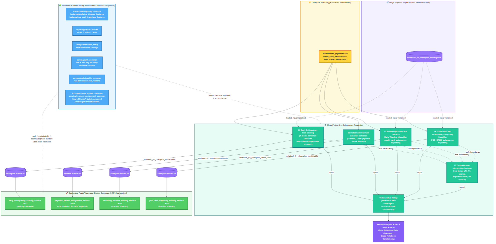

# Mega Project 4 — Delinquency Prevention

Part of the **Home Credit RiskIQ Enterprise Suite**. See the [root
README](../README.md) for the full 5-Mega-Project roadmap and how this
folder fits in.

**Status: 6 of 6 notebooks built, hardened (services + Docker + tests + CI +
GitHub Pages + architecture diagram). Mega Project 4 is complete.**

**2026-09-01 policy change**: per explicit instruction, notebooks from
Problem 3 onward are no longer executed against a synthetic fixture before
delivery, and no `sample_reports/SAMPLE_*` files are generated for them.
New feature logic is instead verified with small, targeted, hand-built
test cases (not a full pipeline run on fabricated data) plus a syntax/AST
check and `nbformat.validate()` on the assembled notebook. Problems 1-2's
existing fixture-generated sample reports predate this change and remain
in the repo unchanged — see [`sample_reports/README.md`](sample_reports/README.md).

**History:** see this Mega Project's own [`CHANGELOG.md`](CHANGELOG.md)
for a curated version history, or the
[root `CHANGELOG.md`](../CHANGELOG.md) for the full suite-wide detail.

## Business problem this Mega Project covers

Early-warning and delinquency-prevention analysis on the real Home Credit
dataset: identifying the leading indicators that separate an account
headed for delinquency from one that isn't, early enough for a proactive
intervention (outreach, restructuring, limit change) rather than a
downstream collections process. Unlike Mega Project 1 (point-of-approval
underwriting), this Mega Project looks at accounts that are already
approved and performing — the only new information available at that stage
is how the applicant actually behaves.

## Problems in this Mega Project

| # | Problem | Notebook | Model card | Service |
|---|---|---|---|---|
| 1 | Early Delinquency Risk Scoring | `notebooks/01_early_delinquency_risk_scoring.ipynb` | [model card](model_cards/01_early_delinquency_risk_scoring_MODEL_CARD.md) | `early_delinquency_scoring_service.py` :8011 |
| 2 | Installment Payment Behavior / Missed-Payment Pattern Detection | `notebooks/02_installment_payment_behavior_detection.ipynb` | [model card](model_cards/02_installment_payment_behavior_detection_MODEL_CARD.md) | `payment_pattern_assignment_service.py` :8012 |
| 3 | Revolving/Credit-Card Distress Early Warning | `notebooks/03_revolving_credit_card_distress_early_warning.ipynb` | [model card](model_cards/03_revolving_credit_card_distress_early_warning_MODEL_CARD.md) | `revolving_distress_scoring_service.py` :8013 |
| 4 | POS/Cash Loan Delinquency Trajectory | `notebooks/04_pos_cash_delinquency_trajectory.ipynb` | [model card](model_cards/04_pos_cash_delinquency_trajectory_MODEL_CARD.md) | `pos_cash_trajectory_scoring_service.py` :8014 |
| 5 | Early-Warning Intervention Ranking | `notebooks/05_early_warning_intervention_ranking.ipynb` | [model card](model_cards/05_early_warning_intervention_ranking_MODEL_CARD.md) | none — population-level fusion, see model card |
| 6 | Executive Rollup (all 5 above) | `notebooks/06_mp4_executive_report.ipynb` | [model card](model_cards/06_mp4_executive_report_MODEL_CARD.md) | none — not a model |

## Architecture



Data → the HYPER shared library (`src/`) → the 6 notebooks → deployable
FastAPI services, hardened with real X-API-Key auth and per-request
explainability from day one. Full-resolution image:
[`docs/mp4_architecture_flow.png`](../docs/mp4_architecture_flow.png)
([Mermaid source](../docs/mp4_architecture_flow.mmd)).

**Problem-by-problem scope, in plain terms:**

1. **Early Delinquency Risk Scoring** *(built)* — predicts which
   currently-performing loans are likely to go 30+ days past due, using
   only the applicant's own real installment-payment history
   (`installments_payments.csv`) — never application-time covariates.
   Cross-compared (never merged or retrained) against Mega Project 1
   Notebook 01's champion on the identical holdout population, so the two
   real, complementary signals are visible side by side. **2026-09-01: a real
   data-quality fix** — see [model card](model_cards/01_early_delinquency_risk_scoring_MODEL_CARD.md#real-data-quality-fix-2026-09-01)
   — changed this notebook's numbers; re-run if you ran it before that date.
2. **Installment Payment Behavior / Missed-Payment Pattern Detection**
   *(built)* — real, unsupervised K-Means clustering (never trained
   against `TARGET`) on 7 real payment-streak features — longest late/
   on-time streak, streak counts, the applicant's CURRENT streak, and a
   real alternation rate — finding data-driven payment-pattern archetypes,
   distinct from Problem 1's rate-based supervised classifier. See its
   [model card](model_cards/02_installment_payment_behavior_detection_MODEL_CARD.md).
3. **Revolving/Credit-Card Distress Early Warning** *(built)* — real
   utilization spikes, minimum-payment-only streaks, and drawdown velocity
   from `credit_card_balance.csv` (direction of change, not level or rate),
   feeding a real supervised classifier, distinct from Mega Project 3
   Notebook 04's unsupervised rate/level segmentation of the same table.
   See its [model card](model_cards/03_revolving_credit_card_distress_early_warning_MODEL_CARD.md).
4. **POS/Cash Loan Delinquency Trajectory** *(built)* — real DPD spikes,
   real DPD streaks, and real instalment-repayment-progress velocity on
   `POS_CASH_balance.csv` (direction of change, not level, rate, or sum),
   feeding a real supervised classifier, distinct from MP1's SUM totals and
   Mega Project 3 Notebook 03's rate/level segmentation of the same table.
   See its [model card](model_cards/04_pos_cash_delinquency_trajectory_MODEL_CARD.md).
5. **Early-Warning Intervention Ranking** *(built)* — trains nothing new;
   a real, disclosed fusion of whichever of Problems 1-4's own real
   per-applicant scores are present (soft dependencies), percentile-
   normalized within their own scope and averaged into a real composite,
   benchmarked against a naive current-DPD-only baseline via a real
   chi-square test on real top-decile default-capture rates. See its
   [model card](model_cards/05_early_warning_intervention_ranking_MODEL_CARD.md).
6. **Executive Rollup** *(built)* — trains, clusters, and fits nothing
   new; a real, disclosed rollup of whichever of Problems 1-5's own
   already-computed real governance summaries are present (soft
   dependencies), consolidated into one executive report. Adds two
   genuinely new pieces of synthesis: a real behavioral-data coverage
   comparison across Problems 1-4 (each problem's real scope population as
   a fraction of the real total applicant base), and a real cross-notebook
   consistency check confirming Problem 5's own signal-availability record
   matches which of Problems 1-4's summaries actually exist. See its
   [model card](model_cards/06_mp4_executive_report_MODEL_CARD.md).

## Problem 1 — Early Delinquency Risk Scoring

Trains a real, 4-model-screened classifier (`LogisticRegression`,
`DecisionTreeClassifier`, `RandomForestClassifier`,
`GradientBoostingClassifier`) on 12 real behavioral features engineered
from `installments_payments.csv` by the new, HYPER
[`src/features/delinquency_features.py`](../src/features/delinquency_features.py)
module — how often an applicant pays late, by how much, whether they
underpay, and whether that behavior is trending better or worse. Verified
via a real 5-fold CV champion selection, a true holdout evaluation with a
bootstrap 95% confidence interval on ROC-AUC, and a real decile-calibration
monotonicity check. When Mega Project 1 Notebook 01's champion bundle is
present, this notebook also loads it (a soft dependency, never retrained)
to report a real, honest side-by-side ROC-AUC comparison on the identical
holdout population — see the
[model card](model_cards/01_early_delinquency_risk_scoring_MODEL_CARD.md)
for the full methodology and the real numbers from this build's
verification run.

Sample reports (fixture-generated, see the [zero-fabrication
disclosure](sample_reports/README.md)):
[HTML dashboard](sample_reports/SAMPLE_notebook_01_dashboard.html) ·
[Word report](sample_reports/SAMPLE_notebook_01_report.docx) ·
[Excel workbook](sample_reports/SAMPLE_notebook_01_workbook.xlsx).

## Problem 2 — Installment Payment Behavior / Missed-Payment Pattern Detection

Trains no supervised model. Builds 7 real, vectorized payment-streak
features from `installments_payments.csv` (longest late/on-time streak,
streak counts, the applicant's *current* streak, and a real alternation
rate — via a real shift+cumsum run-length encoding, no per-applicant
Python loop) and applies real, data-driven K-Means clustering — the number
of clusters chosen by the highest real silhouette score, never fixed.
Validated with a real chi-square/Cramer's V test (with a bootstrap 95%
CI) against real `TARGET`, and — honestly, not gated pass/fail — a real
one-way ANOVA cross-check against Notebook 01's continuous risk score when
present. On this build's synthetic fixture the statistical-robustness
verdict came back **NOT YET STATISTICALLY ROBUST** (chi-square p≈0.085 on
a small, randomly-generated 2,715-applicant fixture) — reported as-is,
not smoothed over; see the
[model card](model_cards/02_installment_payment_behavior_detection_MODEL_CARD.md)
for the full methodology, **a real crash this notebook had on full-scale
real data and the fix for it**, and your real run's numbers.

Sample reports (fixture-generated, see the [zero-fabrication
disclosure](sample_reports/README.md)):
[HTML dashboard](sample_reports/SAMPLE_notebook_02_dashboard.html) ·
[Word report](sample_reports/SAMPLE_notebook_02_report.docx) ·
[Excel workbook](sample_reports/SAMPLE_notebook_02_workbook.xlsx).

## Problem 3 — Revolving/Credit-Card Distress Early Warning

Trains a real, 4-model-screened classifier (same architecture as Problem 1)
on 9 real trajectory features engineered from `credit_card_balance.csv` by
the new, HYPER
[`src/features/revolving_distress_features.py`](../src/features/revolving_distress_features.py)
module — real utilization spikes (month-over-month change, not a static
mean/max), real minimum-payment-only streaks (vectorized run-length
encoding, same technique as Problem 2), and real balance/drawings-growth
velocity (recency-split trend, same technique as Problem 1). Verified via
the same real 5-fold CV champion selection, true holdout evaluation with a
bootstrap 95% confidence interval on ROC-AUC, and decile-calibration
monotonicity check as Problem 1. When available, this notebook loads BOTH
MP1 Notebook 01's champion bundle AND MP4 Notebook 01's real per-applicant
scores (two independent soft dependencies, neither retrained) to report
real, honest side-by-side ROC-AUC comparisons — see the
[model card](model_cards/03_revolving_credit_card_distress_early_warning_MODEL_CARD.md)
for the full methodology.

**No sample report** — per the 2026-09-01 policy change above, this
notebook was not executed against any fixture, so there is nothing
fixture-generated to show. Run it on your real data for real numbers.

## Problem 4 — POS/Cash Loan Delinquency Trajectory

Trains a real, 4-model-screened classifier (same architecture as Problems
1 and 3) on 8 real trajectory features engineered from
`POS_CASH_balance.csv` by the new, HYPER
[`src/features/pos_cash_trajectory_features.py`](../src/features/pos_cash_trajectory_features.py)
module — real DPD spikes (month-over-month change, threshold 5 days), real
DPD streaks (vectorized run-length encoding), and real instalment-
repayment-progress velocity (recency-split trend in remaining instalment
count). Verified via the same real 5-fold CV champion selection, true
holdout evaluation with a bootstrap 95% confidence interval on ROC-AUC,
and decile-calibration monotonicity check as Problems 1 and 3. When
available, this notebook loads THREE independent soft dependencies — MP1
Notebook 01, MP4 Notebook 01, and MP4 Notebook 03 — to report real,
honest side-by-side ROC-AUC comparisons. See the
[model card](model_cards/04_pos_cash_delinquency_trajectory_MODEL_CARD.md)
for the full methodology.

**No sample report** — same 2026-09-01 policy as Problem 3.

## Problem 5 — Early-Warning Intervention Ranking

Trains nothing new from raw data. A real, disclosed fusion of whichever of
Problems 1-4's own already-computed real per-applicant scores are present
on disk (soft dependencies, never fabricated for a missing one), via
`src/features/pos_cash_trajectory_features.py`'s `compute_naive_current_dpd()`
for the naive baseline. Each available signal is percentile-rank-
normalized to [0, 1] within its own real scope population; an applicant's
real composite score is the mean of whichever signals they actually have,
with a real, disclosed `COVERAGE_COUNT` (never silently 0 for a missing
signal). Notebook 02's categorical payment patterns are converted to a
real numeric proxy using that run's own real observed default rate per
pattern — never a hardcoded mapping. Benchmarked against each applicant's
most recent real `SK_DPD` (no modeling at all) via a real top-decile
default-capture-rate comparison and a real chi-square significance test —
reported honestly whichever way it comes out, never smoothed over if the
naive baseline wins or ties. See the
[model card](model_cards/05_early_warning_intervention_ranking_MODEL_CARD.md)
for the full methodology.

**No sample report** — same 2026-09-01 policy as Problems 3-4.

## Problem 6 — Executive Rollup

Trains, clusters, and fits nothing new — reads only the real
`decision_engine/reports/notebook_0N_summary.json` each of Problems 1-5's
own notebooks already wrote, and rolls them up. Missing summaries are
reported and skipped, never fabricated, so this notebook runs with as few
as 1 of the 5 problems present. Two genuinely new pieces of synthesis:
"Real Behavioral Data Coverage" (each of Problems 1-4's real scope
population as a fraction of the real total applicant base, independently
re-derived, not assumed equal across product lines) and a real
cross-notebook consistency check (Problem 5's own real
`signals_available` record checked against which of Problems 1-4's real
summaries actually exist on this run). Surfaces all three of this Mega
Project's verdict-tier families — Statistical Robustness (Problems 1, 3,
4), Clustering Robustness (Problem 2), and Ranking Comparison (Problem 5)
— side by side, correctly labeled, never conflated. See the
[model card](model_cards/06_mp4_executive_report_MODEL_CARD.md) for the
full methodology.

**No sample report** — same 2026-09-01 policy as Problems 3-5.

## Standing rules (apply to every notebook here)

- **Zero-fabrication**: notebooks only ever run against real data you
  provide (the Kaggle dataset) or, for this repo's own verification, a
  synthetic fixture matching the real schema — never against a description
  of what the real output "should" look like.
- **WARP** resource governance: CPU/memory ceilings are configured before
  any heavy library import, so a notebook never claims 100% of the host
  machine.
- **HYPER** shared library: feature engineering, reporting, and serving
  code live once in `src/` and are imported by every notebook here — not
  copy-pasted per problem.
- `RANDOM_SEED = 42` everywhere randomness is involved, for reproducibility.
- One markdown cell + one consolidated code cell per notebook.
- Problems 1-2 were executed for real (`jupyter nbconvert --execute`)
  against a synthetic fixture during this build's verification, confirmed
  0 errors, then had outputs cleared before delivery — see the root
  README's verification-protocol section for the full checklist. **From
  Problem 3 onward, per the 2026-09-01 policy change above, no synthetic
  fixture is used** — new logic is verified with small, targeted, hand-built
  test cases plus a syntax/AST check and `nbformat.validate()` instead.
- **Hardened from day one (2026-09-02)**: unlike Mega Projects 1-3, whose
  services needed a real retrofit to add authentication (see the root
  `CHANGELOG.md` [1.9.7]), Mega Project 4's 4 services were built with real
  `X-API-Key` auth, per-request explainability, a non-root Docker user, and
  a real `HEALTHCHECK` from the start — see [1.9.8].

## Running the notebooks

1. Download the real **Home Credit Default Risk** dataset from Kaggle (not
   redistributed in this repo — see `data/raw/.gitkeep` at the suite root).
2. Create `project_config.json` at the suite root — see the notebook's
   first markdown cell for the exact expected format/paths.
3. `pip install -e ".[dev,serving,explainability]"` from the suite root.
4. (Optional but recommended) Run Mega Project 1 Notebook 01 first, so
   Problems 1, 3, and 4's real side-by-side comparisons have something
   real to load.
5. Run `notebooks/01_early_delinquency_risk_scoring.ipynb`, then
   `notebooks/02_installment_payment_behavior_detection.ipynb`, then
   `notebooks/03_revolving_credit_card_distress_early_warning.ipynb`, then
   `notebooks/04_pos_cash_delinquency_trajectory.ipynb`, in that order —
   each of 03/04 gets a richer real comparison the more of 01-03 already
   exist, though every notebook still runs standalone.
6. Run `notebooks/05_early_warning_intervention_ranking.ipynb` next — it
   combines whichever of 01-04's real outputs it finds (as few as 1 of 4
   is enough to run).
7. Run `notebooks/06_mp4_executive_report.ipynb` last — it rolls up
   whichever of 01-05's real outputs it finds (as few as 1 of 5 is enough
   to run).
8. Outputs land in `decision_engine/artifacts/` (the trained model
   bundles, per-applicant scores CSVs, the real composite ranking) and
   `decision_engine/reports/` (JSON/HTML/Word/Excel, including the
   Notebook 06 rollup package), overwritten in place on every run.

## Running the scoring services

```bash
# from the suite root, after running notebooks 01/02/03/04 so their .joblib bundles exist
pip install -r 04_mega_project_4_delinquency_prevention/services/requirements-services.txt
export PYTHONPATH="$PWD/src:$PWD/04_mega_project_4_delinquency_prevention/services"
uvicorn early_delinquency_scoring_service:app --port 8011      # Problem 1
uvicorn payment_pattern_assignment_service:app --port 8012      # Problem 2
uvicorn revolving_distress_scoring_service:app --port 8013      # Problem 3
uvicorn pos_cash_trajectory_scoring_service:app --port 8014     # Problem 4
```

Every `/schema` and `/score` endpoint requires a real `X-API-Key` header
(`/health` stays open, for liveness probes) — see
[`src/serving/auth_common.py`](../src/serving/auth_common.py). Set a real
`API_KEY` before running:

```bash
export API_KEY=$(python -c "import secrets; print(secrets.token_urlsafe(32))")
```

Or via Docker Compose (build context is the **suite root**, not this
folder — see the comment at the top of `docker/docker-compose.yml`; copy
`docker/.env.example` to `docker/.env` and set a real `API_KEY` first):

```bash
# from the suite root
docker compose -f 04_mega_project_4_delinquency_prevention/docker/docker-compose.yml up --build
```

**Honesty note**: the Docker files were verified structurally in this
build's environment (`docker compose config`, plus a static COPY-path
resolution check) — there is no Docker daemon or registry access in the
build sandbox, so an actual `docker build`/`docker run` has **not** been
performed by this project. Treat it as untested until you build it
yourself; see `BENCHMARKS.md` at the suite root.

## Tests

```bash
cd 04_mega_project_4_delinquency_prevention && python -m pytest tests/ -v
```

4 tests in `tests/test_scoring_services.py` check each service's output
against an independent reference computation (the 3 classifier services
bit-identical against direct `model.predict_proba()` computation; the
clustering service against `assign_segment()` called directly). Every
`/schema`/`/score` call sends a real `X-API-Key` header, and each test also
asserts a 401 with no key. Tests for a given service are skipped (not
failed) when that service's upstream `.joblib` bundle isn't present
locally — this is expected until you've run the corresponding notebook.
The two shared serving modules these services depend on
(`src/serving/auth_common.py`, `src/serving/explainability_common.py`) have
their own real, always-runnable test suite at
[`src/tests/test_serving_common.py`](../src/tests/test_serving_common.py)
(no notebook artifacts needed — `python -m pytest src/tests/ -v` from the
suite root).

## Folder structure

```
04_mega_project_4_delinquency_prevention/
├── notebooks/          # 01-06 built — Mega Project 4 complete
├── model_cards/         # one MODEL_CARD.md per built problem
├── services/             # FastAPI scoring services (thin wrappers over src/serving/)
├── docker/                # Dockerfile + docker-compose.yml (suite-root build context)
├── tests/                  # pytest suite for the services
├── sample_reports/          # SAMPLE_-prefixed fixture-generated deliverables (Problems 1-2 only)
└── decision_engine/
    ├── artifacts/             # trained model bundles (.joblib) + scores/ranking (gitignored)
    └── reports/                # per-notebook JSON/HTML/Word/Excel reports (gitignored)
```
