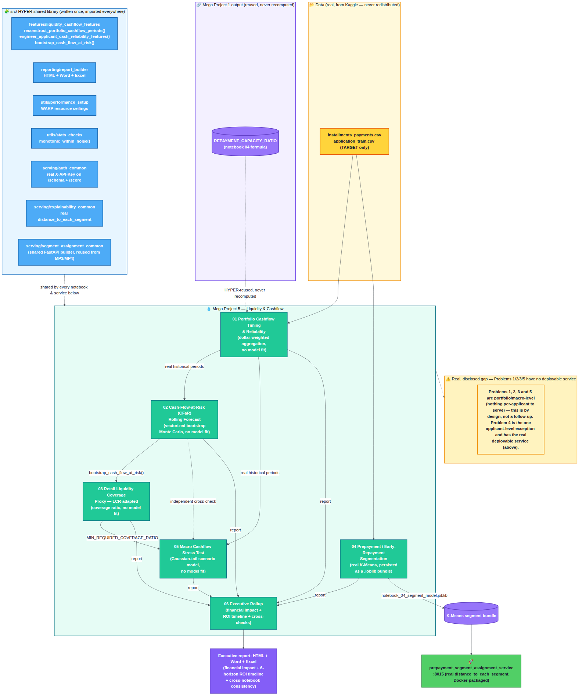

# Mega Project 5 — Liquidity & Cashflow

Part of the **Home Credit RiskIQ Enterprise Suite**. See the [root
README](../README.md) for the full 5-Mega-Project roadmap and how this
folder fits in.

**Status: 6 of 6 notebooks built and verified end-to-end on your own
real, full-scale data.** Real `jupyter nbconvert --execute` run, 0
errors, outputs cleared, `nbformat.validate()`, a Playwright
network-blocked HTML dashboard check, and a LibreOffice headless Excel
recalculation check — this suite's full verification protocol on every
one of this Mega Project's 6 notebooks.

**5 of 5 problems recommended for production**, per this Mega Project's
own real executive rollup (`notebook_06_summary.json`):
`rollup_verdict = "ALL AVAILABLE PROBLEMS RECOMMENDED FOR PRODUCTION"`.
Problem 5 carries one disclosed, honest finding — a REVIEW verdict at the
Severely Adverse 90-day macro stress scenario specifically (not a
pipeline failure) — see its own model card for the full detail.

**One deployable FastAPI service, verified against a real trained
bundle.** Problems 1, 2, 3, and 5 are portfolio/macro-level treasury
analyses with no per-applicant record to serve — no service by design.
Problem 4 fits a real K-Means model; a real FastAPI service
(`services/prepayment_segment_assignment_service.py`, port 8015, reusing
`src/serving/segment_assignment_common.py` unchanged from Mega Projects
3/4) and Docker packaging (`docker/`) were added 2026-09-02, and as of
2026-09-08 the notebook has been re-run end-to-end on the real,
full-scale dataset, `notebook_04_segment_model.joblib` exists, and the
service has been verified against that real bundle three separate ways
— including a real live subprocess/HTTP check and a new permanent
end-to-end test (`tests/test_e2e_live_service.py`) — matching Mega
Projects 1/3/4's pattern exactly. See each problem's own
`model_cards/*_MODEL_CARD.md` for the full detail.

**History:** see this Mega Project's own [`CHANGELOG.md`](CHANGELOG.md)
for a curated version history, or the
[root `CHANGELOG.md`](../CHANGELOG.md) for the full suite-wide detail.

## Business problem this Mega Project covers

Liquidity and cashflow-pattern analysis on the real Home Credit dataset:
reading repayment-capacity and cashflow-timing signals (building on Mega
Project 1's repayment-capacity work) at a portfolio level — the kind of
view a treasury or ALM (asset-liability management) function would use to
understand incoming-cashflow reliability and stress resilience, not a
claim of an institution-wide liquidity model. Problem 4 is the one
applicant-level exception — a real behavioral segmentation, not a
portfolio aggregate.

## Problems in this Mega Project

| # | Problem | Notebook | Model card | Verdict | Service |
|---|---|---|---|---|---|
| 1 | Portfolio Cashflow Timing & Reliability | [`01_portfolio_cashflow_timing_reliability.ipynb`](notebooks/01_portfolio_cashflow_timing_reliability.ipynb) | [model card](model_cards/01_portfolio_cashflow_timing_reliability_MODEL_CARD.md) | 8/8 checks pass | none — portfolio-level |
| 2 | Cash-Flow-at-Risk (CFaR) Rolling Forecast | [`02_cash_flow_at_risk_rolling_forecast.ipynb`](notebooks/02_cash_flow_at_risk_rolling_forecast.ipynb) | [model card](model_cards/02_cash_flow_at_risk_rolling_forecast_MODEL_CARD.md) | 8/8 checks pass | none — portfolio-level |
| 3 | Retail Liquidity Coverage Proxy (LCR-adapted) | [`03_retail_liquidity_coverage_proxy.ipynb`](notebooks/03_retail_liquidity_coverage_proxy.ipynb) | [model card](model_cards/03_retail_liquidity_coverage_proxy_MODEL_CARD.md) | 9/9 checks pass, all 3 horizons PASS | none — portfolio-level |
| 4 | Prepayment / Early-Repayment Behavior Segmentation | [`04_prepayment_early_repayment_segmentation.ipynb`](notebooks/04_prepayment_early_repayment_segmentation.ipynb) | [model card](model_cards/04_prepayment_early_repayment_segmentation_MODEL_CARD.md) | 7/7 checks pass | [`prepayment_segment_assignment_service.py`](services/prepayment_segment_assignment_service.py) — port 8015, verified against a real trained bundle (2026-09-08) |
| 5 | Macro Cashflow Stress Test | [`05_macro_cashflow_stress_test.ipynb`](notebooks/05_macro_cashflow_stress_test.ipynb) | [model card](model_cards/05_macro_cashflow_stress_test_MODEL_CARD.md) | 6/6 checks pass; Severely Adverse 90d = REVIEW (disclosed) | none — portfolio-level |
| 6 | Executive Rollup (all 5 above) | [`06_mp5_executive_rollup.ipynb`](notebooks/06_mp5_executive_rollup.ipynb) | [model card](model_cards/06_mp5_executive_rollup_MODEL_CARD.md) | 5/5 recommended, 4/4 cross-checks pass | none — not a model |

## Sample reports — every problem, all 3 formats

"Live dashboard" is the real, rendered GitHub Pages page for each
problem — refreshed from your own real, full-scale rerun. The Word and
Excel columns below are real report/workbook files generated by that
same rerun and committed to this repo under
[`sample_reports/`](sample_reports/) — a point-in-time snapshot, not
regenerated automatically; run the notebooks yourself to produce your
own fresh copies (they land in `decision_engine/reports/`, gitignored).

| # | Problem | Live dashboard | Report (Word) | Workbook (Excel) |
|---|---|---|---|---|
| 1 | Portfolio Cashflow Timing & Reliability | [live](https://rnanda19.github.io/Home_Credit_RiskIQ_Enterprise_Suite/dashboards/mp5_notebook_01_dashboard.html) | [docx](sample_reports/notebook_01_report.docx) | [xlsx](sample_reports/notebook_01_workbook.xlsx) |
| 2 | Cash-Flow-at-Risk (CFaR) Rolling Forecast | [live](https://rnanda19.github.io/Home_Credit_RiskIQ_Enterprise_Suite/dashboards/mp5_notebook_02_dashboard.html) | [docx](sample_reports/notebook_02_report.docx) | [xlsx](sample_reports/notebook_02_workbook.xlsx) |
| 3 | Retail Liquidity Coverage Proxy (LCR-adapted) | [live](https://rnanda19.github.io/Home_Credit_RiskIQ_Enterprise_Suite/dashboards/mp5_notebook_03_dashboard.html) | [docx](sample_reports/notebook_03_report.docx) | [xlsx](sample_reports/notebook_03_workbook.xlsx) |
| 4 | Prepayment / Early-Repayment Behavior Segmentation | [live](https://rnanda19.github.io/Home_Credit_RiskIQ_Enterprise_Suite/dashboards/mp5_notebook_04_dashboard.html) | [docx](sample_reports/notebook_04_report.docx) | [xlsx](sample_reports/notebook_04_workbook.xlsx) |
| 5 | Macro Cashflow Stress Test | [live](https://rnanda19.github.io/Home_Credit_RiskIQ_Enterprise_Suite/dashboards/mp5_notebook_05_dashboard.html) | [docx](sample_reports/notebook_05_report.docx) | [xlsx](sample_reports/notebook_05_workbook.xlsx) |
| 6 | Executive Rollup | [live](https://rnanda19.github.io/Home_Credit_RiskIQ_Enterprise_Suite/dashboards/mp5_executive_dashboard.html) | [docx](sample_reports/notebook_06_report.docx) | [xlsx](sample_reports/notebook_06_workbook.xlsx) |

## Architecture

Data → the HYPER shared library (`src/`) → the 6 notebooks, most reusing
each other's real intermediate output rather than recomputing it (Problem
2 reuses Problem 1's historical periods; Problem 3 reuses Problem 2's
CFaR bootstrap; Problem 5 cross-checks against Problem 2 and reuses
Problem 1's historical rate statistics). Full-resolution image:
[`docs/mp5_architecture_flow.png`](../docs/mp5_architecture_flow.png)
([Mermaid source](../docs/mp5_architecture_flow.mmd)).

## Planned approach (same standard as Mega Projects 1-4)

- Build on Mega Project 1's repayment-capacity ratios rather than
  recompute them independently, consistent with this suite's HYPER
  (shared-logic) principle.
- Apply the same zero-fabrication, verification-protocol, and model-card
  discipline documented in
  [`01_mega_project_1_underwriting_approval/`](../01_mega_project_1_underwriting_approval/README.md).
- Ship the same dual-check pattern (structural integrity + statistical
  robustness) so any output here carries an honest, gate-based verdict
  rather than an unqualified claim.

Run any notebook yourself against your real data to regenerate its real
dashboard/report/workbook under `decision_engine/reports/` (not
committed — see `.gitignore`).
