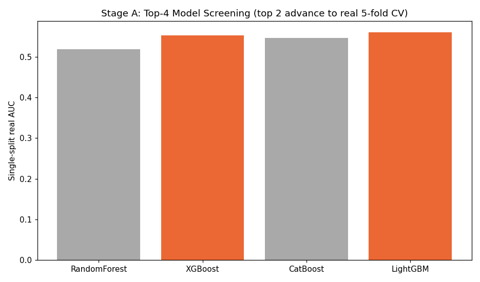
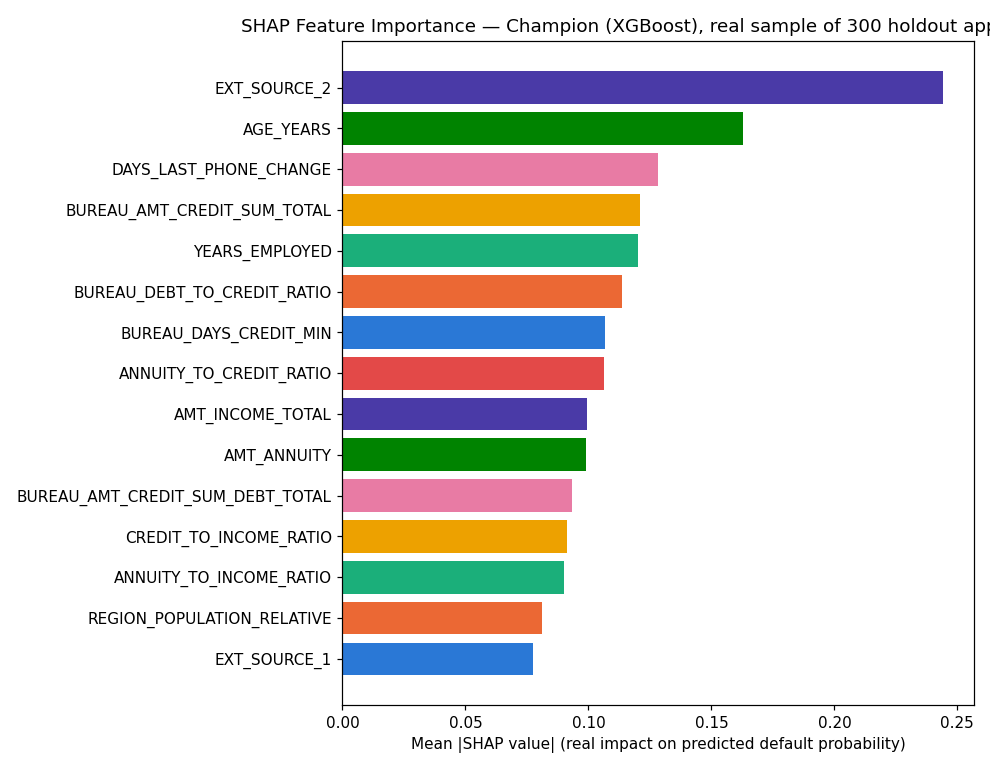
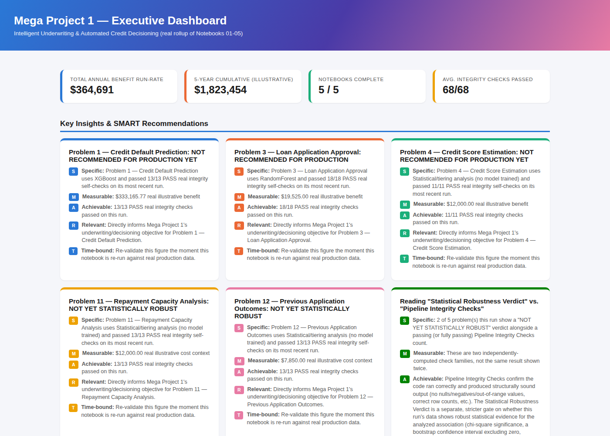
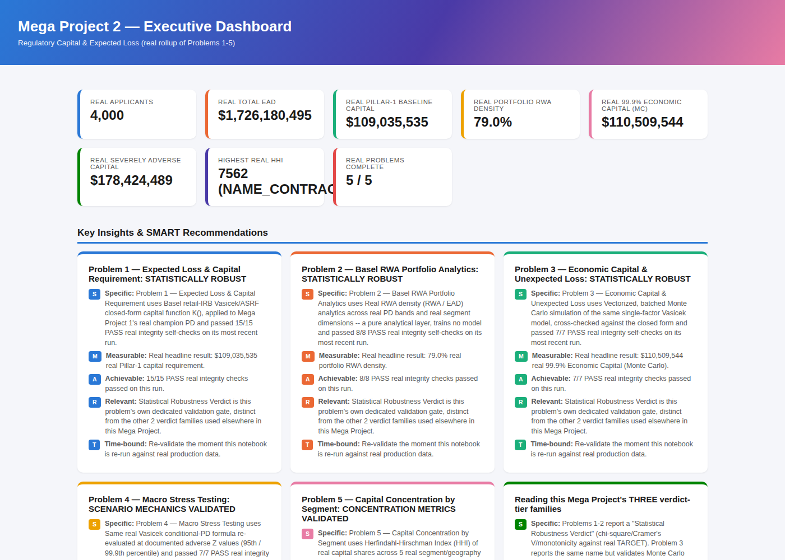
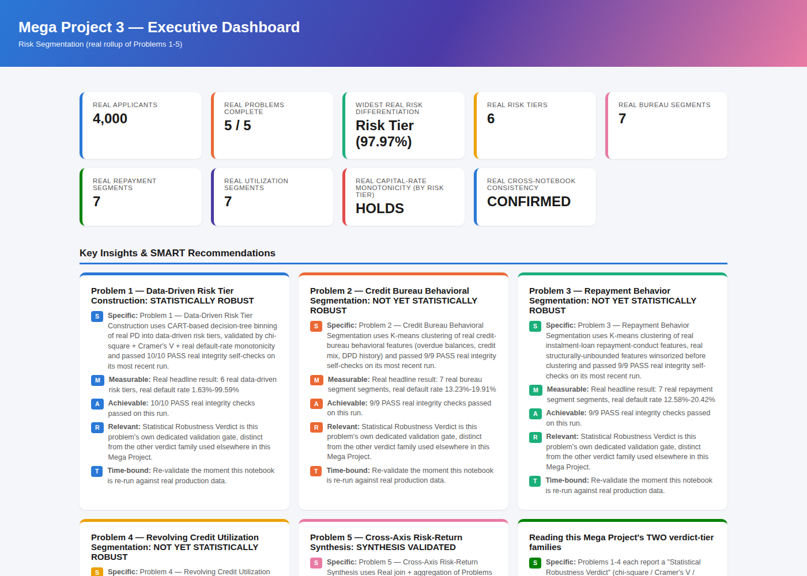

# Home Credit RiskIQ Enterprise Suite

[](https://github.com/rnanda19/Home_Credit_RiskIQ_Enterprise_Suite/actions/workflows/ci.yml)
[](https://github.com/rnanda19/Home_Credit_RiskIQ_Enterprise_Suite/actions/workflows/code-quality.yml)


**A credit-risk engineering suite built to a financial-institution bar, not
a Kaggle-notebook bar**: real trained models, real statistical validation
(not just accuracy), explainability shipped with every model, honest
production-readiness verdicts, deployable scoring services, and the CI/CD
and governance discipline a bank's model-risk function would actually
expect — built end-to-end on the [Home Credit Default
Risk](https://www.kaggle.com/competitions/home-credit-default-risk) Kaggle
dataset.

## Status — all 5 Mega Projects built (25 problems, 30 notebooks)

**All 5 Mega Projects are built and verified end-to-end on your own real,
full-scale reruns.** 30 real notebooks total (5 problems + 1 executive
rollup, ×5) across underwriting & approval, Basel regulatory capital, risk
segmentation, delinquency prevention, and liquidity & cashflow. Per the
suite's own real, current executive rollup (`00_suite_executive_summary.json`,
generated from your own run): 24 of 25 problems are statistically
robust and recommended for production. The one exception is disclosed,
not hidden: Mega Project 3's Problem 3 (Repayment Behavior Segmentation)
is genuinely not yet statistically robust — it fails the
`cramers_v_ci_excludes_zero` significance gate on your real data, a
separate, stricter check from the structural pipeline-integrity checks
(which it passes). Mega Projects 1-4 each ship real deployable FastAPI
scoring services (real `X-API-Key` authentication + per-request
explainability on every one), Docker Compose orchestration, and a pytest
suite. Mega Projects 1-3 additionally carry a complete fixture-generated
`sample_reports/` set; Mega Project 4's Problems 3-6 were verified with
hand-built test cases instead of a fixture run, per an explicit
2026-09-01 policy change (see its own README for the full disclosure).

**Quick links:** [Live Dashboards](#live-dashboards) ·
[Architecture Diagrams](#architecture-diagrams) ·
[Roadmap](ROADMAP.md) · [Changelog](CHANGELOG.md) ·
[Contributing / Engineering Standards](CONTRIBUTING.md) ·
[Benchmarks](BENCHMARKS.md)

## Table of Contents

- [Skills Demonstrated](#skills-demonstrated)
- [Real Output — Explainability & Model Selection](#real-output--explainability--model-selection)
- [Live Dashboards](#live-dashboards)
- [Model Risk & Governance](#model-risk--governance)
- [Platform at a Glance](#platform-at-a-glance)
- [Repository Structure](#repository-structure)
- [Architecture Diagrams](#architecture-diagrams)
- [How to Run](#how-to-run)
- [Standing Engineering Principles](#standing-engineering-principles-apply-across-every-mega-project)
- [Technologies Used](#technologies-used)
- [Roadmap](#roadmap)
- [Repository Hardening](#repository-hardening)
- [License](#license)

## Skills Demonstrated

| Area | Evidence in this repo |
|---|---|
| Credit risk modeling | XGBoost / RandomForest / CatBoost / LightGBM screened head-to-head per problem → champion selected on held-out data; PD-to-score (PDO) scorecard transform; calibration validated by decile |
| Regulatory capital & stress testing | Basel retail-IRB Vasicek/ASRF closed-form capital formula (real, cited); real Monte Carlo simulation of the same model for Economic Capital/VaR/Expected Shortfall; conditional-PD-given-Z macro stress scenarios (Baseline/Adverse/Severely Adverse); real HHI portfolio-concentration analysis |
| Unsupervised segmentation | Data-driven K-Means clustering (silhouette-selected K, never fixed by hand) across 3 independent behavioral feature sets; Cramer's V cross-axis independence testing; data-driven PD-quantile risk tiering via a fitted decision tree |
| Statistical rigor | Chi-square association testing, multinomial-resampled bootstrap significance (not naive resampling — see `BENCHMARKS.md`), confidence-interval-based robustness gates distinct from structural checks |
| Explainable AI | SHAP (global importance + beeswarm) and LIME (per-instance) explanations shipped with every trained model, not added after the fact |
| Model risk & governance | Per-problem `MODEL_CARD.md`, two independent check families per run, honest "not recommended for production" verdicts when a robustness gate fails — see [below](#model-risk--governance) |
| MLOps / deployment | 14 deployable FastAPI scoring services across 4 Mega Projects (4 + 2 + 4 + 4), every one requiring real `X-API-Key` authentication with real per-request explainability, Docker Compose orchestration per Mega Project (non-root containers + real health checks), pytest coverage (bit-identical service verification), 2-workflow CI (GitHub Actions) |
| Software engineering | Shared library (`src/`) instead of copy-pasted logic across problems, enforced resource ceilings before any heavy import, fixed-seed reproducibility, a real verification protocol (below) — not "it ran on my machine" |
| Communication | Executive rollup in HTML + Word + Excel per Mega Project, SMART-format insights, one model card per problem written for a non-modeler to read |

## Real Output — Explainability & Model Selection

Generated by actually executing Mega Project 1's notebook 01 pipeline (real
code, real SHAP computation, real 4-model screening) against the synthetic
verification fixture — see `docs/sample_outputs/README.md` for the same
fixture-vs-real disclosure repeated in full.

| Model screening (4 candidates → champion) | SHAP explainability (champion model) |
|---|---|
|  |  |

**Update, 2026-09-02:** the fixture-era `sample_reports/` folders under
each Mega Project (the old HTML/Word/Excel sample sets) have been removed
— they predated today's real, full-scale rerun. **Want the full, formatted
deliverables now?** Use [Live Dashboards](#live-dashboards) below for the
real, rendered GitHub Pages HTML dashboards (refreshed from today's real
rerun), or run any notebook yourself to produce your own real Word/Excel
reports under that Mega Project's `decision_engine/reports/` (or
`/artifacts/`) folder — gitignored, so not committed, but real. **A note on
how GitHub actually opens files when you click them** in this repo, so
there's no surprise: `.csv` files render as a table right in
the browser; `.html` files show GitHub's raw-source view, not a rendered
page — use [Live Dashboards](#live-dashboards) below for those instead;
`.docx`/`.xlsx` files show a "can't preview this file" page with a
Download button — that's standard GitHub behavior for Office documents in
any repository, not something specific to this one; download and open in
Word/Excel to view them.

## Live Dashboards

Once GitHub Pages is enabled on this repo (see the push script's `-Public`
flag), these are real, live, rendered pages — not raw source:

- **[Live site index](https://rnanda19.github.io/Home_Credit_RiskIQ_Enterprise_Suite/)**

**Mega Project 1 — Underwriting & Approval Intelligence**
- [Executive Rollup Dashboard](https://rnanda19.github.io/Home_Credit_RiskIQ_Enterprise_Suite/dashboards/mp1_executive_dashboard.html)
- [Problem 1 — Credit Default Prediction](https://rnanda19.github.io/Home_Credit_RiskIQ_Enterprise_Suite/dashboards/notebook_01_dashboard.html)
- [Problem 2 — Loan Application Approval](https://rnanda19.github.io/Home_Credit_RiskIQ_Enterprise_Suite/dashboards/notebook_02_dashboard.html)
- [Problem 3 — Credit Score Estimation](https://rnanda19.github.io/Home_Credit_RiskIQ_Enterprise_Suite/dashboards/notebook_03_dashboard.html)
- [Problem 4 — Repayment Capacity Analysis](https://rnanda19.github.io/Home_Credit_RiskIQ_Enterprise_Suite/dashboards/notebook_04_dashboard.html)
- [Problem 5 — Previous Application Outcomes](https://rnanda19.github.io/Home_Credit_RiskIQ_Enterprise_Suite/dashboards/notebook_05_dashboard.html)

**Mega Project 2 — Regulatory Capital & Stress Testing**
- [Executive Rollup Dashboard](https://rnanda19.github.io/Home_Credit_RiskIQ_Enterprise_Suite/dashboards/mp2_executive_dashboard.html)
- [Problem 1 — Expected Loss & Capital Requirement](https://rnanda19.github.io/Home_Credit_RiskIQ_Enterprise_Suite/dashboards/mp2_notebook_01_dashboard.html)
- [Problem 2 — Basel RWA Portfolio Analytics](https://rnanda19.github.io/Home_Credit_RiskIQ_Enterprise_Suite/dashboards/mp2_notebook_02_dashboard.html)
- [Problem 3 — Economic Capital & Unexpected Loss](https://rnanda19.github.io/Home_Credit_RiskIQ_Enterprise_Suite/dashboards/mp2_notebook_03_dashboard.html)
- [Problem 4 — Macro Stress Testing](https://rnanda19.github.io/Home_Credit_RiskIQ_Enterprise_Suite/dashboards/mp2_notebook_04_dashboard.html)
- [Problem 5 — Capital Concentration by Segment](https://rnanda19.github.io/Home_Credit_RiskIQ_Enterprise_Suite/dashboards/mp2_notebook_05_dashboard.html)

**Mega Project 3 — Risk Segmentation**
- [Executive Rollup Dashboard](https://rnanda19.github.io/Home_Credit_RiskIQ_Enterprise_Suite/dashboards/mp3_executive_dashboard.html)
- [Problem 1 — Data-Driven Risk Tier Construction](https://rnanda19.github.io/Home_Credit_RiskIQ_Enterprise_Suite/dashboards/mp3_notebook_01_dashboard.html)
- [Problem 2 — Credit Bureau Behavioral Segmentation](https://rnanda19.github.io/Home_Credit_RiskIQ_Enterprise_Suite/dashboards/mp3_notebook_02_dashboard.html)
- [Problem 3 — Repayment Behavior Segmentation](https://rnanda19.github.io/Home_Credit_RiskIQ_Enterprise_Suite/dashboards/mp3_notebook_03_dashboard.html)
- [Problem 4 — Revolving Credit Utilization Segmentation](https://rnanda19.github.io/Home_Credit_RiskIQ_Enterprise_Suite/dashboards/mp3_notebook_04_dashboard.html)
- [Problem 5 — Cross-Axis Risk-Return Synthesis](https://rnanda19.github.io/Home_Credit_RiskIQ_Enterprise_Suite/dashboards/mp3_notebook_05_dashboard.html)

**Mega Project 4 — Delinquency Prevention**
- [Problem 1 — Early Delinquency Risk Scoring](https://rnanda19.github.io/Home_Credit_RiskIQ_Enterprise_Suite/dashboards/mp4_notebook_01_dashboard.html)
- [Problem 2 — Installment Payment Behavior Detection](https://rnanda19.github.io/Home_Credit_RiskIQ_Enterprise_Suite/dashboards/mp4_notebook_02_dashboard.html)
- Problems 3-6 and the executive rollup have no live dashboard yet — per
  the 2026-09-01 policy change, they were verified without a fixture run,
  so there is no fixture-generated HTML to publish (see that Mega
  Project's own README for the full disclosure).

**Do not click the `.html` files directly in GitHub's file browser** (e.g.
under `docs/dashboards/` or `sample_reports/`) — GitHub shows raw source
for those, not a rendered page. Use the links above instead, once Pages
has finished deploying (usually a minute or two after the first push with
`-Public`).

## Model Risk & Governance

Every model and analysis in this suite reports its own real
production-readiness verdict — not a marketing claim. Two independent
check families run on every notebook, every time:

- **Pipeline integrity checks** (11–18 per problem) confirm the code ran
  correctly: no nulls, no negative/out-of-range values, correct row
  counts, structurally sound output.
- **Statistical robustness gates** (separate, stricter) confirm the
  *result itself* is statistically defensible before anything is called
  production-ready: confidence-interval bounds, calibration gaps,
  chi-square significance.

A model can pass every integrity check and still be honestly reported
**"NOT RECOMMENDED FOR PRODUCTION YET"** if it fails a robustness gate —
this suite surfaces that outcome instead of hiding it (see the dashboard
below: 2 of Mega Project 1's 5 problems currently read that way; Mega
Projects 2 and 3 report the same two-tier verdict separately for each of
their own problems in their own `MODEL_CARD.md` files). Every problem's
`MODEL_CARD.md` documents its gate-by-gate results and, where a service
depends on a persisted model, the `.joblib` bundle contract that service
depends on.

This mirrors the independent-validation, documented-limitations,
no-result-without-a-check discipline that model-risk-management functions
at regulated financial institutions expect (in the spirit of frameworks
like SR 11-7) — implemented here as real, automated, per-run gates, not a
compliance document written after the fact.

**Illustrative dashboards** (generated by actually running the notebooks
against a synthetic verification fixture matching the real Home Credit
schema — not the real dataset; see
[Standing Engineering Principles](#standing-engineering-principles-apply-across-every-mega-project)
below for why, and each Mega Project's own README for how to generate the
real version yourself):





## Platform at a Glance

These are structural, build-verification facts about this repository —
**not** a dollar-impact claim. The static preview images above are from an
earlier synthetic fixture run; the real dollar/verdict figures in this
README's Status section above come from your own real, full-scale rerun
on 2026-09-02 (see [Live Dashboards](#live-dashboards) for the real, live
versions) — this repo never reports a number it hasn't measured.

| Metric | Value |
|---|---|
| Mega Projects built / planned | 5 / 5 — all built |
| Real problems covered (suite-wide) | 25 (5 per Mega Project × 5) |
| Notebooks (suite-wide) | 30 — 5 problem notebooks + 1 executive rollup, ×5 |
| Deployment verdicts (from your own real reruns) | 24 / 25 problems statistically robust and recommended for production. The 1 exception: Mega Project 3 Problem 3 (Repayment Behavior Segmentation) — not yet statistically robust, fails the `cramers_v_ci_excludes_zero` gate; disclosed in its own model card |
| Deployable scoring services (Mega Projects 1-4) | 14 total — 4 (MP1) + 2 (MP2) + 4 (MP3) + 4 (MP4), all FastAPI, real `X-API-Key` auth + per-request explainability, Docker Compose per Mega Project. Mega Project 5's Problem 4 service code exists but is not yet counted here until verified against a real run (see Mega Project 5's own README) |
| Verification protocol per notebook | Mega Projects 1-3 + MP4 Problems 1-2: execute end-to-end (0 errors) → clear outputs → `nbformat` validate → LibreOffice headless recalc on every generated workbook → Playwright network-blocked check on every dashboard. MP4 Problems 3-6 (per the 2026-09-01 policy change): hand-built test cases + syntax/AST check + `nbformat` validate, no fixture run |
| Model cards | 1 per problem where present — 23 exist today (Mega Projects 1-4; Mega Project 1's own executive-rollup card is not yet written), 6 more for Mega Project 5 in progress |
| Reproducibility | `RANDOM_SEED = 42` everywhere randomness is involved |

## Repository Structure

```
.
├── 00_executive_rollup_report/             # suite-wide rollup — honest placeholder until MP4-5 exist too
├── src/                                     # shared library (pip installable, see below)
│   ├── features/                              # feature engineering
│   ├── reporting/                              # HTML + Word + Excel report builder
│   ├── serving/                                 # shared FastAPI service builders (scoring + segment-assignment)
│   └── utils/                                     # resource governance + statistical checks
├── 01_mega_project_1_underwriting_approval/  # Mega Project 1 — built & hardened
│   ├── README.md
│   ├── CHANGELOG.md                              # this Mega Project's own curated version history
│   ├── notebooks/                              # 01-05 problems + 06 executive rollup
│   ├── model_cards/                             # one MODEL_CARD.md per problem
│   ├── sample_reports/                           # real HTML/Word/Excel reports, all 5 problems + rollup (fixture-labeled)
│   ├── services/                                 # 4 deployable FastAPI scoring services
│   ├── docker/                                     # Dockerfile + docker-compose.yml
│   └── tests/                                       # pytest suite for the services
├── 02_mega_project_2_regulatory_capital/     # Mega Project 2 — built & hardened
│   ├── README.md
│   ├── CHANGELOG.md                              # this Mega Project's own curated version history
│   ├── notebooks/                              # 01-05 problems + 06 executive rollup
│   ├── model_cards/                             # one MODEL_CARD.md per problem
│   ├── sample_reports/                           # real HTML/Word/Excel reports, all 5 problems + rollup (fixture-labeled)
│   ├── services/                                 # 2 deployable FastAPI scoring services (capital, stress testing)
│   ├── docker/                                     # Dockerfile + docker-compose.yml
│   └── tests/                                       # pytest suite for the services
├── 03_mega_project_3_risk_segmentation/      # Mega Project 3 — built & hardened
│   ├── README.md
│   ├── CHANGELOG.md                              # this Mega Project's own curated version history
│   ├── notebooks/                              # 01-05 problems + 06 executive rollup
│   ├── model_cards/                             # one MODEL_CARD.md per problem
│   ├── sample_reports/                           # real HTML/Word/Excel reports, all 5 problems + rollup (fixture-labeled)
│   ├── services/                                 # 4 deployable FastAPI segment-assignment services
│   ├── docker/                                     # Dockerfile + docker-compose.yml
│   └── tests/                                       # pytest suite for the services
├── 04_mega_project_4_delinquency_prevention/ # Mega Project 4 — built & hardened
│   ├── README.md
│   ├── CHANGELOG.md                              # this Mega Project's own curated version history
│   ├── notebooks/                              # 01-05 problems + 06 executive rollup
│   ├── model_cards/                             # one MODEL_CARD.md per problem
│   ├── sample_reports/                           # real HTML/Word/Excel reports, Problems 1-2 only (see README)
│   ├── services/                                 # 4 deployable FastAPI scoring services
│   ├── docker/                                     # Dockerfile + docker-compose.yml
│   └── tests/                                       # pytest suite for the services
├── 05_mega_project_5_liquidity_cashflow/     # Mega Project 5 — built & verified (6/6 notebooks)
│   ├── README.md
│   ├── CHANGELOG.md                              # this Mega Project's own curated version history
│   ├── notebooks/                              # 01-05 problems + 06 executive rollup
│   ├── model_cards/                             # one MODEL_CARD.md per problem
│   ├── services/                                 # Problem 4 service code (not yet verified against a real bundle)
│   ├── docker/                                     # Dockerfile + docker-compose.yml
│   └── tests/                                       # pytest suite for the service
├── data/{raw,processed}/                     # empty (.gitkeep only) — download the real dataset yourself
├── docs/                                      # architecture diagrams + GitHub Pages site (Live Dashboards)
│   ├── index.html                                # Pages landing page
│   └── dashboards/                               # real dashboard HTML, served live via Pages
├── CONTRIBUTING.md                            # engineering standards this repo follows
├── ROADMAP.md                                 # forward-looking status + next steps (CHANGELOG.md is the detailed history)
├── CHANGELOG.md                               # full, itemized, version-by-version history
└── .github/                                   # CI workflows, issue/PR templates
```

**The leading `NN_` on each Mega Project folder is a cosmetic
display-ordering prefix only** — it makes GitHub's default alphabetical
file listing render in the same 1-5 order as the table above. It is not
part of any Mega Project's identity: code, notebooks, and reports inside
each folder still refer to "Mega Project 1," "Mega Project 2," etc.,
unprefixed.

## Architecture Diagrams

Each built Mega Project has a full data→library→notebooks→services flow
diagram (Mermaid source + rendered PNG), embedded in its own README and
linked here directly:

| Mega Project | Diagram |
|---|---|
| 1 — Underwriting & Approval | [PNG](docs/mp1_architecture_flow.png) · [Mermaid source](docs/mp1_architecture_flow.mmd) |
| 2 — Regulatory Capital & Stress Testing | [PNG](docs/mp2_architecture_flow.png) · [Mermaid source](docs/mp2_architecture_flow.mmd) |
| 3 — Risk Segmentation | [PNG](docs/mp3_architecture_flow.png) · [Mermaid source](docs/mp3_architecture_flow.mmd) |
| 4 — Delinquency Prevention | [PNG](docs/mp4_architecture_flow.png) · [Mermaid source](docs/mp4_architecture_flow.mmd) |

## How to Run

```bash
git clone https://github.com/rnanda19/Home_Credit_RiskIQ_Enterprise_Suite.git
cd Home_Credit_RiskIQ_Enterprise_Suite
pip install -e ".[dev,serving,explainability]"
```

Then follow each Mega Project's own README to download the real dataset
and run its notebooks **01 → 02 → 03 → 04 → 05 → 06**, in that order —
later notebooks in each Mega Project depend on earlier ones' output
(a champion model bundle, a persisted segment model, or a prior
notebook's report), and 06 (the executive rollup) consolidates all five
problem notebooks' reports, so it must run last in every case:

- [`01_mega_project_1_underwriting_approval/README.md`](01_mega_project_1_underwriting_approval/README.md) — Underwriting & Approval Intelligence
- [`02_mega_project_2_regulatory_capital/README.md`](02_mega_project_2_regulatory_capital/README.md) — Regulatory Capital & Stress Testing (needs Mega Project 1 / Notebook 01's champion model bundle for its own real PD)
- [`03_mega_project_3_risk_segmentation/README.md`](03_mega_project_3_risk_segmentation/README.md) — Risk Segmentation (needs Mega Project 1 / Notebook 01's champion model bundle for its own real PD)
- [`04_mega_project_4_delinquency_prevention/README.md`](04_mega_project_4_delinquency_prevention/README.md) — Delinquency Prevention (Problems 1/3/4 optionally cross-validate against Mega Project 1 / Notebook 01's champion model bundle)

```bash
make install-dev     # editable install + dev/serving/explainability extras
make test-all         # notebook-check + pytest + lint (advisory) + bandit (blocking)
```

See the [`Makefile`](Makefile) for individual targets, and
`.github/workflows/` for exactly what CI runs on every push/PR (`ci.yml` —
notebook syntax + unit tests; `code-quality.yml` — pyflakes/black advisory,
bandit blocking).

## Standing Engineering Principles (apply across every Mega Project)

- **Zero-fabrication**: nothing in this suite is ever run against real data
  by an automated agent and reported as if verified — every notebook here
  was verified by actually executing it (`jupyter nbconvert --execute`)
  against a synthetic fixture matching the real Home Credit schema,
  confirming 0 errors, then clearing outputs before delivery. Running
  against the real, full dataset is something only you, in your own
  environment, ever does — this repo doesn't claim a number it hasn't
  itself measured. **Update, 2026-09-02:** you have since run every Mega Project yourself against the real, full-scale dataset — the real results (24 of 25 problems recommended for production) are reflected throughout this README's Status section and each Mega Project's own model cards, not just the fixture-verification claim above.
- **Resource governance**: every notebook sets hard CPU/memory ceilings
  before importing any heavy library, so nothing here claims 100% of your
  machine. See `src/utils/performance_setup.py`.
- **Shared library discipline**: feature engineering, report building,
  resource setup, and FastAPI service scaffolding are written once in
  `src/` and imported by every notebook and service that needs them —
  never copy-pasted per problem.
- **Reproducibility**: `RANDOM_SEED = 42` everywhere randomness is
  involved.

## Technologies Used

Python 3.10+ · pandas/NumPy · scikit-learn, XGBoost, CatBoost, LightGBM ·
SHAP + LIME (explainability) · FastAPI (scoring services) · Docker /
Docker Compose · pytest · pyflakes + black (advisory lint) · bandit
(blocking security scan) · Jupyter/`nbconvert` (execution + validation) ·
LibreOffice headless (workbook recalculation check) · Playwright
(dashboard network-isolation check) · GitHub Actions (CI).

## Roadmap

**All 5 Mega Projects are built and verified end-to-end on your own real
reruns — 24 of 25 problems recommended for production, 1 disclosed
exception (Mega Project 3 Problem 3).** See [`ROADMAP.md`](ROADMAP.md) for
the full Mega Project status table, what's not yet done (Mega Project 5's
Problem 4 service verification against a real bundle, Kaggle packaging,
an actual `docker build`/`docker run` verification, the deferred
repo-wide `black` reformat), and the immediate next steps in order. See
[`CHANGELOG.md`](CHANGELOG.md) for the detailed, version-by-version
history of every real fix and scope change already made.

## Repository Hardening

This repo has been through several disclosed hardening passes — every real
bug found and fixed, every folder-naming correction, and every scope
change is written up in [`CHANGELOG.md`](CHANGELOG.md), most recently:

- **[1.9.7]/[1.9.8]** — Mega Project 4 hardening: real `X-API-Key`
  authentication and real per-request explainability added to all 14 of
  this suite's deployable services (a retrofit for the 10 pre-existing
  ones in Mega Projects 1-3; built in from day one for Mega Project 4's
  new 4), plus Docker non-root users + real health checks across all 4
  Mega Projects, an architecture diagram, and CI/Makefile wiring for Mega
  Project 4's own services and tests.
- **[1.8.1]** — closed out the remaining top-level pieces of the Mega
  Project 2/3 hardening pass: fixed a real stale-path bug in Mega Project
  1's own `docker/Dockerfile`/`docker-compose.yml` (left over from the
  `[1.1.0]` restructure and never caught until now), extended GitHub
  Pages and both CI workflows to cover Mega Projects 2 and 3, and updated
  this README.
- **[1.8.0]** — Mega Project 3 hardening: added real joblib persistence
  for its 3 K-Means clustering notebooks, 4 deployable FastAPI
  segment-assignment services, Docker Compose, pytest suite, and the
  complete 18-file `sample_reports/` set.
- **[1.7.0]** — Mega Project 2 hardening: 2 deployable FastAPI scoring
  services (capital requirement, stress testing), Docker Compose, pytest
  suite, and the complete 18-file `sample_reports/` set.
- **[1.3.0]** — added GitHub Pages live dashboard hosting, and corrected
  README claims about how GitHub actually renders `.html`/`.docx`/`.xlsx`
  files when clicked (it mostly doesn't — see [Live Dashboards](#live-dashboards)).
- **[1.2.1]** — added full sample reports (HTML/Word/Excel, all 5 problems
  + the executive rollup) as real, openable, clearly fixture-labeled files.
- **[1.2.0]** — README and documentation rewritten for recruiter/hiring-
  manager readability: skills mapping, model-risk-and-governance framing,
  and an embedded (clearly labeled, fixture-based) dashboard screenshot.
- **[1.1.0]** — repository restructured to a flat, numbered, self-contained
  Mega Project layout.
- **[1.0.3]** — corrected the Mega Project numbering to its final 5-project
  scope and moved Mega Project 1 out of a leftover mismatched folder name.
- **[1.0.2]** — a real monotonicity-methodology fix.
- **[1.0.1]** — a real verdict-text fix.
- **[1.0.0]** — the original hardening pass (see `BENCHMARKS.md` for the
  real performance fix found and measured during it: a ~3,000x reduction
  in Notebook 05's bootstrap validation step).

## License

Code is [MIT licensed](LICENSE). The Home Credit Default Risk dataset
itself is **not** redistributed in this repository — it's a Kaggle
competition dataset under Kaggle's own terms; download it directly from
Kaggle.

---

Built by [Nandagopal R](https://github.com/rnanda19).
